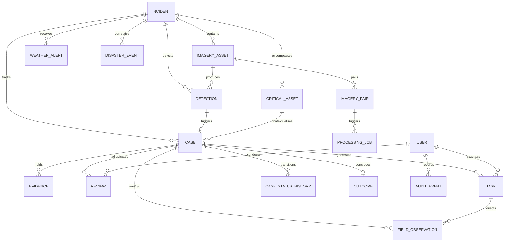

# Core Domain Concepts & Entity Models

Implemented

DRAXELYRA models emergency operations through an interconnected graph of domain entities. Every entity has a strictly defined lifecycle, explicit ownership, optimistic concurrency control (OCC) versioning, and immutable audit tracking.

---

## 1. Incident (`incidents`)
An **Incident** defines an active or historical crisis operating theater bounded by geographical coordinates, hazard type, and operational timelines.
- **Key Attributes**: `id`, `name`, `disasterType` (Flood, Cyclone, Earthquake, Fire), `status` (`Active`, `Closed`), `aoi` (GeoJSON Polygon/MultiPolygon), `severity`, `sourceApi` (USGS, GDACS, SACHET, MANUAL), `externalEventId`.
- **Database Table**: `incidents` ([`lib/db/src/schema/index.ts:20`](file:///c:/Users/Dell/Downloads/DRAXELYRA-Response-OS/DRAXELYRA-Response-OS/lib/db/src/schema/index.ts#L20-L36)).
- **Lifecycle**: Created via live external API webhook/poll or incident commander $\to$ Active operational triage $\to$ Closed after recovery operations.

## 2. Area of Interest (AOI)
The **AOI** is a spatial bounding polygon representing the operational boundary of an incident. All spatial queries, OSM infrastructure clippings, Sentinel STAC swath intersections, and FIRMS hotspot queries are constrained within the AOI.
- **Format**: RFC 7946 GeoJSON `Polygon` or `MultiPolygon` in WGS 84 (`EPSG:4326`).

## 3. Earth Observation Product & Imagery Asset (`imagery_assets`)
A raster or complex SAR dataset acquired by airborne sensors or satellite constellations (Sentinel-1 SAR, Sentinel-2 MSI, Planet, Maxar).
- **Key Attributes**: `id`, `incidentId`, `source` (`Copernicus`, `USGS`, `ESA`), `acquisitionTime`, `captureType` (`SAR_GRD`, `OPTICAL_L2A`), `geometry` (swath footprint), `bbox`, `cloudCover`, `processingLevel`, `storagePath`, `dataMode` (`REAL` vs `DEMO`).
- **Database Table**: `imagery_assets` ([`lib/db/src/schema/index.ts:38`](file:///c:/Users/Dell/Downloads/DRAXELYRA-Response-OS/DRAXELYRA-Response-OS/lib/db/src/schema/index.ts#L38-L68)).

## 4. Imagery Pair (`imagery_pairs`)
A temporal pairing of a baseline (pre-event) and target (post-event) imagery asset over the same geographical AOI used for change detection.
- **Key Attributes**: `id`, `beforeImageryId`, `afterImageryId`, `overlapPercentage`, `temporalDeltaHours`, `status`.
- **Database Table**: `imagery_pairs` ([`lib/db/src/schema/index.ts:242`](file:///c:/Users/Dell/Downloads/DRAXELYRA-Response-OS/DRAXELYRA-Response-OS/lib/db/src/schema/index.ts#L242-L252)).

## 5. Critical Asset (`critical_assets` & `osm_critical_assets`)
Fixed physical infrastructure whose damage or isolation poses immediate risk to human life, emergency egress, or essential lifeline utilities.
- **Classifications**: `Hospital` (100), `Emergency` (100), `Bridge` (85), `Utility` (75), `Substation` (75), `Telecom` (75), `School` (70), `Residential` (40), `Commercial` (30).
- **Attributes**: `id`, `name`, `type`, `location` (GeoJSON Point), `criticalityScore` ($0\text{--}100$), `populationExposureTier` (`High`, `Medium`, `Low`), `osmId`.
- **Database Table**: `critical_assets`, `osm_critical_assets` ([`lib/db/src/schema/index.ts:70,273`](file:///c:/Users/Dell/Downloads/DRAXELYRA-Response-OS/DRAXELYRA-Response-OS/lib/db/src/schema/index.ts#L70-L78)).

## 6. Detection (`detections`)
A machine-extracted anomaly, backscatter coherence loss, or spectral index variance produced by an AI model or external hazard feed.
- **Key Attributes**: `id`, `incidentId`, `imageryId`, `geometry` (Point or Polygon), `class` (e.g., `Flooded Ingress`, `Structural Collapse`), `severity` (`Minor`, `Moderate`, `Severe`, `Destroyed`), `confidence` ($0.00\text{--}1.00$), `modelName`, `modelVersion`, `inferenceTimestamp`.
- **Database Table**: `detections` ([`lib/db/src/schema/index.ts:80`](file:///c:/Users/Dell/Downloads/DRAXELYRA-Response-OS/DRAXELYRA-Response-OS/lib/db/src/schema/index.ts#L80-L94)).

## 7. Case (`cases`)
The **Case** is the central transactional unit in DRAXELYRA. It couples an automated Detection with a Critical Asset and Incident, wrapping them in an explainable priority score, an authoritative human review state, and an optimistic concurrency version.
- **Key Attributes**: `id`, `incidentId`, `detectionId`, `assetId`, `status`, `priorityScore`, `priorityBreakdown` (JSONB), `reviewState` (`NEEDS_REVIEW`, `CONFIRMED`, `REJECTED`, `UNCERTAIN`), `owner`, `version`, `dataMode`.
- **Database Table**: `cases` ([`lib/db/src/schema/index.ts:96`](file:///c:/Users/Dell/Downloads/DRAXELYRA-Response-OS/DRAXELYRA-Response-OS/lib/db/src/schema/index.ts#L96-L110)).
- **State Machine**: Governed by `transitionCase()` in [`artifacts/api-server/src/services/case-state-machine.ts`](file:///c:/Users/Dell/Downloads/DRAXELYRA-Response-OS/DRAXELYRA-Response-OS/artifacts/api-server/src/services/case-state-machine.ts).

## 8. Explainable Priority Score
A deterministic 5-factor integer metric ($0\text{--}100$) reflecting operational triage urgency:
$$\text{Priority} = \text{round}\Big(0.30\cdot S + 0.25\cdot C + 0.20\cdot E + 0.15\cdot U + 0.10\cdot K\Big)$$
where $S$ is Severity ($0\text{--}100$), $C$ is Facility Criticality ($15\text{--}100$), $E$ is Population Exposure ($20\text{--}90$), $U$ is Urgency with 72h decay ($0\text{--}100$), and $K$ is Model Confidence ($0\text{--}100$).

## 9. Review & Adjudication (`reviews`)
An authoritative decision recorded by an authenticated watchstander. AI models never finalize cases autonomously; human confirmation is legally required.
- **Key Attributes**: `id`, `caseId`, `reviewer` (FK to `users`), `decision` (`CONFIRMED`, `REJECTED`, `UNCERTAIN`), `reason`, `notes`, `createdAt`.
- **Database Table**: `reviews` ([`lib/db/src/schema/index.ts:126`](file:///c:/Users/Dell/Downloads/DRAXELYRA-Response-OS/DRAXELYRA-Response-OS/lib/db/src/schema/index.ts#L126-L134)).

## 10. Response Task (`tasks`)
A concrete operational mission dispatched to a tactical agency, liaison team, or responder unit following case confirmation.
- **Key Attributes**: `id`, `caseId`, `title`, `description`, `priority`, `assignedTeam`, `assignedUser`, `status`, `version`, `dueAt`, `escalationAt`, `completedAt`.
- **Lifecycle**: `UNASSIGNED -> ASSIGNED -> IN_PROGRESS -> BLOCKED -> COMPLETED -> VERIFIED -> CLOSED`.
- **Database Table**: `tasks` ([`lib/db/src/schema/index.ts:136`](file:///c:/Users/Dell/Downloads/DRAXELYRA-Response-OS/DRAXELYRA-Response-OS/lib/db/src/schema/index.ts#L136-L150)).

## 11. Field Observation (`field_observations`)
Ground-truth telemetry, damage verification, and physical inspection notes submitted from tactical field devices.
- **Key Attributes**: `id`, `caseId`, `taskId`, `location` (GPS Point), `media` (photo URIs, hashes), `notes`, `verificationStatus` (`CONFIRMED_DAMAGED`, `NO_DAMAGE_FOUND`, `INACCESSIBLE`), `syncStatus` (`LOCAL_PENDING`, `SYNCED`, `CONFLICT`), `version`.
- **Database Table**: `field_observations` ([`lib/db/src/schema/index.ts:152`](file:///c:/Users/Dell/Downloads/DRAXELYRA-Response-OS/DRAXELYRA-Response-OS/lib/db/src/schema/index.ts#L152-L163)).

## 12. Evidence & Media Artifact (`evidence`)
A validated multimedia artifact (drone video, satellite geotiff crop, field inspection photo) supporting an operational case.
- **Key Attributes**: `id`, `caseId`, `type`, `uri`, `source`, `mimeType`, `size`, `checksum` (SHA-256), `metadata` (EXIF GPS, camera specs), `createdBy`.
- **Database Table**: `evidence` ([`lib/db/src/schema/index.ts:112`](file:///c:/Users/Dell/Downloads/DRAXELYRA-Response-OS/DRAXELYRA-Response-OS/lib/db/src/schema/index.ts#L112-L124)).

## 13. Outcome (`outcomes`)
The formal after-action conclusion of an operational case, capturing actions executed, lives assisted, and infrastructure restored.
- **Key Attributes**: `id`, `caseId`, `action` (e.g., `Evacuation Completed`, `Access Road Cleared`), `result`, `evidence`, `completedBy`, `completedAt`.
- **Database Table**: `outcomes` ([`lib/db/src/schema/index.ts:165`](file:///c:/Users/Dell/Downloads/DRAXELYRA-Response-OS/DRAXELYRA-Response-OS/lib/db/src/schema/index.ts#L165-L173)).

## 14. Audit Event (`audit_events`)
An immutable, append-only record tracking every state transition, user login, permission check, evidence upload, and API dispatch across the system.
- **Key Attributes**: `id`, `actorId`, `entityType`, `entityId`, `action`, `metadata`, `timestamp`.
- **Database Table**: `audit_events` ([`lib/db/src/schema/index.ts:185`](file:///c:/Users/Dell/Downloads/DRAXELYRA-Response-OS/DRAXELYRA-Response-OS/lib/db/src/schema/index.ts#L185-L193)).

## 15. Transactional Outbox Event (`outbox_events`)
An atomic event log persisted inside the database transaction ensuring guaranteed, at-least-once message delivery over WebSockets and SSE without split-brain anomalies.
- **Database Table**: `outbox_events` ([`lib/db/src/schema/index.ts:411`](file:///c:/Users/Dell/Downloads/DRAXELYRA-Response-OS/DRAXELYRA-Response-OS/lib/db/src/schema/index.ts#L411-L426)).

## 16. Processing Job (`processing_jobs`)
An asynchronous background task orchestrating satellite discovery, product download, ortho-rectification, or change index computation.
- **Job Types**: `DISCOVERY`, `DOWNLOAD`, `PREPROCESS`, `CHANGE_DETECTION`, `THUMBNAIL`.
- **Database Table**: `processing_jobs` ([`lib/db/src/schema/index.ts:254`](file:///c:/Users/Dell/Downloads/DRAXELYRA-Response-OS/DRAXELYRA-Response-OS/lib/db/src/schema/index.ts#L254-L271)).

## 17. AI Decision Log (`ai_decision_logs`)
A cryptographic audit ledger recording every multimodal AI prompt, input image hash, raw JSON response, token usage, latency, and subsequent human agreement or override.
- **Database Table**: `ai_decision_logs` ([`lib/db/src/schema/index.ts:354`](file:///c:/Users/Dell/Downloads/DRAXELYRA-Response-OS/DRAXELYRA-Response-OS/lib/db/src/schema/index.ts#L354-L373)).

---

## Implementation References

- Database Schema Definitions: [`lib/db/src/schema/index.ts`](file:///c:/Users/Dell/Downloads/DRAXELYRA-Response-OS/DRAXELYRA-Response-OS/lib/db/src/schema/index.ts)
- Case Transition Service: [`artifacts/api-server/src/services/case-state-machine.ts`](file:///c:/Users/Dell/Downloads/DRAXELYRA-Response-OS/DRAXELYRA-Response-OS/artifacts/api-server/src/services/case-state-machine.ts)
- Task Transition Service: [`artifacts/api-server/src/services/task-state-machine.ts`](file:///c:/Users/Dell/Downloads/DRAXELYRA-Response-OS/DRAXELYRA-Response-OS/artifacts/api-server/src/services/task-state-machine.ts)
- Outbox Queue Service: [`artifacts/api-server/src/realtime/outbox.ts`](file:///c:/Users/Dell/Downloads/DRAXELYRA-Response-OS/DRAXELYRA-Response-OS/artifacts/api-server/src/realtime/outbox.ts)

