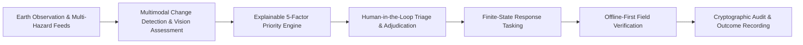
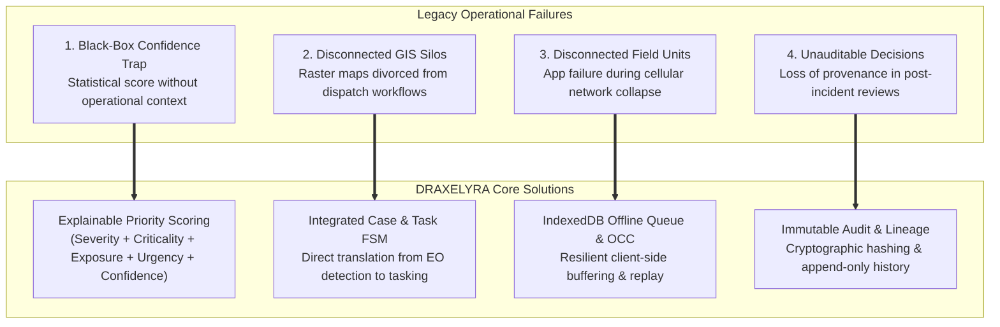

# Introduction to DRAXELYRA

Implemented Real Data Mode Scenario Replay

**DRAXELYRA** is a mission-critical **Disaster Intelligence & Response Operating System** engineered for emergency operations centers (EOCs), geospatial intelligence analysts, incident commanders, and tactical field response units.

In rapid-onset disaster theaters—such as severe urban flooding, tropical cyclones, and seismic events—command centers suffer from an acute operational bottleneck: raw Earth Observation (EO) satellite swaths, sensor feeds, and emergency alerts produce immense volumes of unverified, unstructured signals that cannot be translated into rapid, auditable field operations. DRAXELYRA bridges this gap by transforming post-event satellite imagery and multi-hazard feeds into **explainable priority queues**, **finite-state response tasks**, and **tamper-evident, field-verified outcomes**.

---

## The Four Core Operational Failures Solved

DRAXELYRA was architected specifically to overcome four systemic failure modes observed in legacy emergency management and GIS software:

1. **The Black-Box Confidence Trap**: Computer vision models generate statistical probabilities (e.g., "91% confidence of water index change") without understanding whether the centroid represents an inundated tertiary trauma hospital or an empty retention basin. DRAXELYRA explicitly separates statistical model confidence from operational consequence using an explainable multi-factor scoring formula.
2. **Disconnected Evidence and Operational Action**: Geospatial analysts frequently analyze change detections in standalone GIS desktops, leaving incident commanders and field teams disconnected. DRAXELYRA unifies geospatial analysis with finite-state dispatch queues so that verified detections automatically become actionable response tasks.
3. **Severe Network Degradation in Disaster Theaters**: Responders in affected zones frequently lose cellular and broadband connectivity. DRAXELYRA treats disconnection as a baseline operating condition by buffering field observations in client IndexedDB queues, synchronizing them sequentially upon reconnection with optimistic concurrency control (OCC).
4. **Lack of Accountable Auditability in After-Action Reviews**: In after-action investigations, agencies often cannot determine who authorized a specific triage decision or what satellite pass was used as evidence. DRAXELYRA records an append-only, tamper-evident audit ledger for every review transition, task status modification, and evidence upload.

---

## Architectural Pillars & Technology Stack

| Subsystem | Technology | Source Location | Implementation Status |
| :--- | :--- | :--- | :--- |
| **Command Console** | React 19, Vite 7, Tailwind CSS v4, Wouter, Radix UI Primitives, Lucide Icons | `artifacts/draxelyra/src/` | Implemented |
| **Geospatial Engine** | MapLibre GL, React-Map-GL, GeoJSON FeatureCollections, Carto Vector Basemaps, ArcGIS Satellite Fallback | `artifacts/draxelyra/src/components/map/` | Implemented |
| **Priority Engine** | Deterministic 5-factor scoring algorithm (`0.30*S + 0.25*C + 0.20*E + 0.15*U + 0.10*K`) with 72h decay | `artifacts/api-server/src/lib/priority.ts` | Implemented |
| **State Machines** | Strict finite state machines for Cases and Tasks with atomic Compare-and-Swap (CAS) OCC | `artifacts/api-server/src/services/case-state-machine.ts`, `task-state-machine.ts` | Implemented |
| **Real-Time Gateway** | Dual WebSocket (`/ws`) and SSE (`/api/events`) with Transactional Outbox pattern | `artifacts/api-server/src/realtime/` | Implemented |
| **Offline Sync & PWA** | Service Worker (`/sw.js`), IndexedDB (`draxelyra-offline`), HTTP 409 conflict detection | `artifacts/draxelyra/src/lib/offline-sync.ts` | Implemented |
| **Evidence Pipeline** | Multipart upload, magic-byte MIME validation, SHA-256 integrity hashing | `artifacts/api-server/src/routes/evidence.ts` | Implemented |
| **AI Subsystem** | Dual Provider: Google Gemini Multimodal (`@google/genai`) & Mock Vision Baseline | `artifacts/api-server/src/ai/` | Implemented |
| **Backend & Storage** | Express 5, PostgreSQL 15, Drizzle ORM, `connect-pg-simple` session store | `artifacts/api-server/src/`, `lib/db/` | Implemented |
| **External Ingestion** | Ingestion workers for SACHET (NDMA), USGS, GDACS, NASA FIRMS, NASA EONET, Open-Meteo, NOAA | `artifacts/api-server/src/services/ingestion-engine.ts` | Implemented |

---

## Operating Modes: Real Data vs Development Replay

DRAXELYRA operates in two primary modes:

1. **Live Real Data Mode**:
   - The backend ingestion engine periodically polls real-world APIs:
     - **SACHET (NDMA)**: Real-time Common Alerting Protocol (CAP) emergency broadcasts across India.
     - **USGS**: Seismic events (M $\ge$ 4.0) over the last 24 hours.
     - **GDACS**: Multi-hazard global alerts (Cyclones, Floods, Earthquakes, Volcanoes).
     - **NASA FIRMS**: VIIRS thermal anomalies and active fire hotspots.
     - **Open-Meteo & OpenWeatherMap**: Real-time river discharge and meteorological observations.
     - **Copernicus CDSE**: Sentinel-1 SAR and Sentinel-2 optical catalog search.
   - Detected events automatically generate active incidents, ingest OpenStreetMap critical assets within the AOI, compute 5-factor priority scores, and publish real-time events over WebSocket.

2. **Scenario Replay Mode (`/demo`)**:
   - A deterministic historical flood scenario (Chennai Urban Floods) designed for operator training, system evaluation, and offline demonstrations.
   - Provides 5 discrete stages: `Initial Inundation`, `Critical Infrastructure Breach`, `Hospital Evacuation Triage`, `Field Verification`, and `After-Action Review`.
   - Seeded via `/api/demo/load` and reset via `/api/demo/reset`.

---

## Implementation References

- Frontend Root & Shell: [`artifacts/draxelyra/src/App.tsx`](file:///c:/Users/Dell/Downloads/DRAXELYRA-Response-OS/DRAXELYRA-Response-OS/artifacts/draxelyra/src/App.tsx)
- Backend Application Entry: [`artifacts/api-server/src/app.ts`](file:///c:/Users/Dell/Downloads/DRAXELYRA-Response-OS/DRAXELYRA-Response-OS/artifacts/api-server/src/app.ts)
- Database Schema: [`lib/db/src/schema/index.ts`](file:///c:/Users/Dell/Downloads/DRAXELYRA-Response-OS/DRAXELYRA-Response-OS/lib/db/src/schema/index.ts)
- Priority Scoring Engine: [`artifacts/api-server/src/lib/priority.ts`](file:///c:/Users/Dell/Downloads/DRAXELYRA-Response-OS/DRAXELYRA-Response-OS/artifacts/api-server/src/lib/priority.ts)
- Ingestion Engine: [`artifacts/api-server/src/services/ingestion-engine.ts`](file:///c:/Users/Dell/Downloads/DRAXELYRA-Response-OS/DRAXELYRA-Response-OS/artifacts/api-server/src/services/ingestion-engine.ts)

