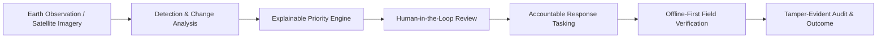

# Introduction to DRAXELYRA

Implemented Development Replay

**DRAXELYRA** is a mission-critical **Disaster Intelligence & Response Operating System** designed for emergency operations centers (EOCs), geospatial intelligence analysts, incident commanders, and tactical field response teams.

In rapid-onset disasters—such as urban flash floods, cyclones, and seismic events—command centers face an acute operational bottleneck: raw Earth Observation (EO) satellite passes and sensor feeds generate vast volumes of unverified damage signals that cannot be translated into rapid, auditable field operations. DRAXELYRA bridges this gap by converting post-event satellite imagery into **explainable priority queues**, **finite-state response tasks**, and **tamper-evident, field-verified outcomes**.

---

## The Four Core Operational Failure Modes Addressed

1. **The Black-Box Confidence Trap**: Generic computer vision models produce statistical confidence scores (e.g., "88% confidence of change") that do not communicate whether the site represents a flooded tertiary hospital or an empty parking lot. DRAXELYRA separates statistical confidence from operational consequence using an explainable multi-factor scoring model.
2. **Disconnected Evidence and Operational Action**: Geospatial analysts frequently isolate change detections in standalone GIS workstations, leaving dispatch boards and emergency responders out of sync. DRAXELYRA creates an integrated pipeline where detected anomalies directly generate versioned operational cases.
3. **Severe Network Degradation in Disaster Theaters**: Responders in affected zones frequently lose broadband connectivity. DRAXELYRA treats network disconnection as a normal operating condition by buffering all field observations and task updates in browser IndexedDB queues and synchronizing them sequentially upon reconnection.
4. **Lack of Accountable Auditability in After-Action Reviews**: When post-incident investigations occur, organizations struggle to establish who authorized a triage decision or what imagery was reviewed. DRAXELYRA records an immutable, append-only audit ledger for every review, task transition, and evidence upload.

---

## Architectural Pillars & Implementation Status

| Architectural Layer | Implementation Technology | Source Location | Status |
| :--- | :--- | :--- | :--- |
| **Command Console** | React 19, Vite 7, Tailwind CSS v4, Wouter, Radix UI Primitives | `artifacts/draxelyra/src/` | Implemented |
| **Geospatial Engine** | MapLibre GL, React-Map-GL, GeoJSON FeatureCollections, Carto Vector Basemaps | `artifacts/draxelyra/src/components/map/` | Implemented |
| **Priority Engine** | Deterministic multi-factor scoring algorithm (`0.30*S + 0.25*C + 0.20*E + 0.15*U + 0.10*K`) | `artifacts/api-server/src/lib/priority.ts` | Implemented |
| **State Machines** | Strict finite state machines for Cases and Tasks with atomic CAS OCC | `artifacts/api-server/src/services/` | Implemented |
| **Offline Sync** | IndexedDB mutation buffer (`draxelyra-offline`) with custom event bus | `artifacts/draxelyra/src/lib/offline-sync.ts` | Implemented |
| **Evidence Pipeline** | Multipart upload with magic-byte validation and SHA-256 integrity hashes | `artifacts/api-server/src/routes/evidence.ts` | Implemented |
| **Backend & Storage** | Express 5, PostgreSQL 15, Drizzle ORM, connect-pg-simple session store | `artifacts/api-server/src/`, `lib/db/` | Implemented |
| **Scenario Replay** | Deterministic Chennai Urban Flood historical dataset (`inc-chennai-demo`) | `artifacts/api-server/src/routes/demo-data.ts` | Development Replay |
| **AI Inference Adapter** | Change-detector v2.4.1 mock adapter for predictable scenario testing | `lib/db/src/schema/index.ts` | Mock Adapter |

---

## Intended Engineering Audience

This technical documentation site provides comprehensive architecture, codebase references, and operational runbooks for:

- **Software Engineers & Architects**: Designing, extending, or refactoring the monorepo services and database schema.
- **Frontend Engineers**: Building UI components, integrating MapLibre layers, and handling offline sync queues.
- **DevOps & SREs**: Containerizing services, provisioning PostgreSQL, and managing environment pipelines.
- **Security & Compliance Reviewers**: Auditing authentication, session storage, RBAC middleware, and file upload integrity.
- **ML / Geospatial Engineers**: Integrating real-world Earth Observation pipelines (Sentinel-2, Planet Labs, Maxar) and fine-tuning change-detection models.
