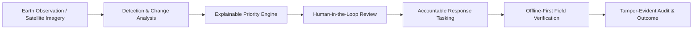

# Introduction to DRAXELYRA

Implemented Development Replay

**DRAXELYRA** is an open, modular **Disaster Intelligence & Response Operating System** designed for emergency management organizations, incident commanders, geospatial analysts, and field response teams. 

Post-disaster environments suffer from information overload, conflicting reports, delayed field triage, and "black-box" artificial intelligence systems that provide opaque scores without operational explanations. DRAXELYRA solves this by transforming raw post-disaster Earth Observation (EO) satellite imagery, aerial surveys, and GIS data into **explainable priorities**, **accountable response tasks**, and **tamper-evident, verified outcomes**.

---

## Core Mission & Problem Statement

In rapid-onset disasters (such as urban floods, hurricanes, and earthquakes), emergency command centers encounter four critical failure modes:

1. **The Black-Box Confidence Trap**: Generic computer vision models produce confidence percentages (e.g., "85% confidence of flood") that do not tell a commander whether a site represents a critical hospital with failing power or an empty commercial parking lot.
2. **Disconnected Evidence and Action**: Geospatial analysts detect structural failures on GIS layers, but these insights remain disconnected from dispatch boards, incident management systems, and field personnel.
3. **Fragile Network Infrastructure**: Field responders operating in disaster zones lose cellular connectivity, causing critical status updates, geolocated photos, and damage reports to drop.
4. **Lack of Auditability and Accountability**: When post-incident after-action reviews take place, organizations struggle to reconstruct who made what decision, at what time, based on which satellite pass or field report.

---

## System Capabilities at a Glance

| Architectural Layer | Implementation | Status |
| :--- | :--- | :--- |
| **Command Console** | React 19, Tailwind CSS v4, Wouter, Radix UI Primitives | Implemented |
| **Geospatial Engine** | MapLibre GL, React-Map-GL, GeoJSON Layers, Carto Vector Basemaps | Implemented |
| **Priority Engine** | Deterministic multi-factor scoring algorithm (`0.30*S + 0.25*C + 0.20*E + 0.15*U + 0.10*Conf`) | Implemented |
| **State Machines** | Strict finite state machines for Cases and Tasks with OCC versioning | Implemented |
| **Offline Sync** | IndexedDB mutation buffer (`draxelyra-offline`) with custom event bus | Implemented |
| **Evidence Pipeline** | Multipart upload with magic-byte validation and SHA-256 integrity hashes | Implemented |
| **Backend & Storage** | Express 5, PostgreSQL 15, Drizzle ORM, connect-pg-simple session store | Implemented |
| **Scenario Replay** | Deterministic Chennai Urban Flood historical dataset (`inc-chennai-demo`) | Development Replay |
| **AI Inference Adapter** | Change-detector v2.4.1 mock adapter for predictable scenario testing | Mock Adapter |

---

## Intended Audience

This technical documentation site provides comprehensive architecture, codebase references, and operational guides for:

- **Software Engineers & Architects**: Designing, extending, or refactoring the monorepo services and database schema.
- **Frontend Engineers**: Building UI components, integrating MapLibre layers, and handling offline sync queues.
- **DevOps & SREs**: Containerizing services, provisioning PostgreSQL, and managing environment pipelines.
- **Security & Compliance Reviewers**: Auditing authentication, session storage, RBAC middleware, and file upload integrity.
- **ML / Geospatial Engineers**: Integrating real-world Earth Observation pipelines (Sentinel-2, Planet Labs, Maxar) and fine-tuning change-detection models.
