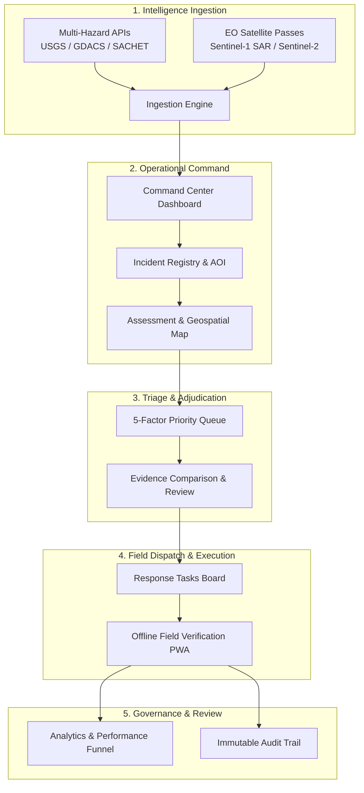

# Product Overview & Core Workspaces

Implemented

DRAXELYRA organizes disaster intelligence and operational response into interconnected, role-governed tactical workspaces. Each workspace is purpose-built for high-density command center wall displays, analyst desktop workstations, and bandwidth-constrained tactical field devices.

---

## User Personas & Operational Roles

DRAXELYRA implements strict Role-Based Access Control (RBAC) to ensure operational authority and accountability during multi-agency response operations:

| Persona / Role | System Identifier | Primary Workspaces | Core Responsibilities |
| :--- | :--- | :--- | :--- |
| **Incident Commander** | `Incident Commander` | Command Center, Incident Registry, Analytics, Tasks | Sets operational priorities, allocates inter-agency resources, oversees SLA compliance, approves major evacuations. |
| **Duty Officer** | `Duty Officer` | Command Center, Priority Queue, Evidence Review | 24/7 watchstander triaging incoming alerts, promoting high-confidence signals into verified cases. |
| **GIS / EO Analyst** | `GIS Analyst` | Satellite Discovery, Assessment Map, Lineage Graph | Queries Copernicus STAC/OData catalogs, evaluates SAR/optical swaths, validates AI change detection bounds. |
| **Field Team Lead** | `Field Lead` | Tasks Board, Field Verification, Offline Queue | Directs tactical search & rescue (SAR) teams, assigns ground verification missions, manages team logistics. |
| **Field Responder** | `Field Responder` | Field Verification Mobile PWA | Conducts on-site physical inspections, records geotagged ground photos, validates structure access in offline mode. |
| **System Administrator** | `System Admin` | Settings, Data Sources, Provider Registry | Manages API keys, monitors connector latency, inspects database outbox, configures AI provider models. |

---

## Detailed Workspace Walkthrough

### 1. Command Center (`/`)
- **Purpose**: Real-time high-level operational picture synthesizing multi-hazard feeds, queue backlogs, active tasks, and recent audit activity.
- **Components & Metrics**:
  - **Backlog**: Total unreviewed cases awaiting operator adjudication.
  - **High Priority**: Cases with a computed 5-factor priority score $\ge 75$.
  - **Open Tasks**: Active response actions currently dispatched.
  - **Overdue Tasks**: Tasks exceeding their dynamic SLA deadline.
  - **Confirmation Rate**: Percentage of AI-detected signals confirmed by human reviewers.
  - **SLA on Track**: Percentage of completed tasks verified within SLA targets.
- **Geospatial Minimap**: Real-time MapLibre GL map showing active incident bounds, critical infrastructure nodes, and detection clusters.
- **Data Sources**: Aggregates `GET /api/command/summary`, `GET /api/incidents`, and `GET /api/weather/alerts`.

### 2. Incident Registry (`/incidents` & `/incidents/:id`)
- **Purpose**: Authoritative catalog of active and historical crisis operations across urban, regional, and national scopes.
- **Features**:
  - Multi-hazard tagging (Flood, Cyclone, Earthquake, Wildfire, Severe Weather).
  - Spatial Area of Interest (AOI) polygon configuration (GeoJSON).
  - Automatic creation from live USGS ($M \ge 4.0$), GDACS, and SACHET CAP emergency broadcasts.
- **Data Sources**: `GET /api/incidents`, `GET /api/incidents/:id`, `POST /api/incidents`.

### 3. Geospatial Assessment Workspace (`/assessment`)
- **Purpose**: Full-screen spatial triage environment for visualizing satellite damage swaths against OpenStreetMap infrastructure layers.
- **Layers**:
  - **AOI Boundary**: Spatial bounding polygon of the operational zone.
  - **Critical Infrastructure**: Color-coded points for Hospitals (Red/Cyan), Schools (Amber), Bridges (Purple), Utilities (Blue).
  - **Damage Detections**: Heatmaps and bounding boxes from multimodal vision analysis.
  - **Fire Hotspots**: NASA FIRMS VIIRS active thermal anomaly coordinates.
- **Data Sources**: `GET /api/incidents/:id/map`, `GET /api/cases?incidentId=:id`.

### 4. Explainable Priority Queue (`/cases`)
- **Purpose**: Dynamic operational triage board sorting detected anomalies by their explainable 5-factor score.
- **Capabilities**:
  - Multi-column filtering by severity (`Minor`, `Moderate`, `Severe`, `Destroyed`), review state (`NEEDS_REVIEW`, `CONFIRMED`, `REJECTED`, `UNCERTAIN`), and critical asset type.
  - Transparent score breakdown popup displaying exact contribution from Severity ($30\%$), Criticality ($25\%$), Population Exposure ($20\%$), Urgency ($15\%$), and Confidence ($10\%$).
- **Data Sources**: `GET /api/cases`.

### 5. Evidence Review & Adjudication (`/cases/:id`)
- **Purpose**: Human-in-the-loop inspection module for reviewing satellite evidence before authorizing field dispatch.
- **Capabilities**:
  - Side-by-side or overlay comparison of pre-event baseline and post-event imagery.
  - Multimodal AI inference summary: observed changes, inferred infrastructural impact, and model uncertainty limitations.
  - Adjudication modal: Confirm, Reject, or mark Uncertain with required operational notes.
  - Optimistic Concurrency Control (OCC) enforcement preventing race conditions between concurrent watchstanders.
- **Data Sources**: `GET /api/cases/:id`, `POST /api/cases/:id/review`.

### 6. Response Tasks Kanban (`/tasks` & `/tasks/:id`)
- **Purpose**: Finite-state dispatch board converting confirmed cases into tactical ground tasks.
- **Columns**: `UNASSIGNED`, `ASSIGNED`, `IN_PROGRESS`, `BLOCKED`, `COMPLETED`, `VERIFIED`, `CLOSED`.
- **Dynamic SLA Windows**:
  - **Score $\ge 75$**: 30-minute urgent response window.
  - **Score $45\text{--}74$**: 2-hour high-priority window.
  - **Score $< 45$**: 8-hour standard window.
- **Data Sources**: `GET /api/tasks`, `PATCH /api/tasks/:id`.

### 7. Field Verification Mobile PWA (`/field`)
- **Purpose**: Lightweight, touch-optimized field client for tactical search and rescue teams operating in degraded communications theaters.
- **Capabilities**:
  - Full offline execution backed by IndexedDB (`draxelyra-offline`).
  - Capture physical ground verification status (`CONFIRMED_DAMAGED`, `NO_DAMAGE_FOUND`, `INACCESSIBLE`).
  - Geotagged observation notes and camera uploads with SHA-256 integrity verification.
  - Background auto-sync upon network reconnection with HTTP 409 conflict detection.
- **Data Sources**: Local IndexedDB queue $\to$ `POST /api/field-observations`, `POST /api/tasks/:id/verify`.

### 8. Analytics & Performance Funnel (`/analytics`)
- **Purpose**: Executive dashboard measuring operational throughput, AI accuracy, and response health.
- **Metrics**:
  - **Conversion Funnel**: `Detections (100%) -> Confirmed (68%) -> Tasked (54%) -> Field Verified (42%) -> Closed (38%)`.
  - **Model vs Human Agreement**: Tracks false positive and false negative rates of AI change-detection models.
  - **Time-to-Triage**: Average minutes from satellite ingestion to human confirmation.
  - **Time-to-Verify**: Average minutes from task creation to field physical verification.
- **Data Sources**: `GET /api/analytics/summary`.

---

## Implementation References

- Frontend Navigation & Shell: [`artifacts/draxelyra/src/App.tsx`](file:///c:/Users/Dell/Downloads/DRAXELYRA-Response-OS/DRAXELYRA-Response-OS/artifacts/draxelyra/src/App.tsx)
- Live Map Component: [`artifacts/draxelyra/src/components/map/IncidentMap.tsx`](file:///c:/Users/Dell/Downloads/DRAXELYRA-Response-OS/DRAXELYRA-Response-OS/artifacts/draxelyra/src/components/map/IncidentMap.tsx)
- AI Assessment Panel: [`artifacts/draxelyra/src/components/ai/AIAssessmentPanel.tsx`](file:///c:/Users/Dell/Downloads/DRAXELYRA-Response-OS/DRAXELYRA-Response-OS/artifacts/draxelyra/src/components/ai/AIAssessmentPanel.tsx)
- Analytics Dashboard: [`artifacts/draxelyra/src/components/ai/AIAnalyticsDashboard.tsx`](file:///c:/Users/Dell/Downloads/DRAXELYRA-Response-OS/DRAXELYRA-Response-OS/artifacts/draxelyra/src/components/ai/AIAnalyticsDashboard.tsx)

