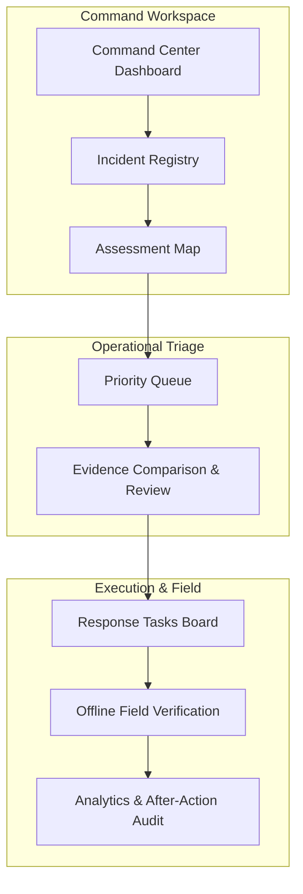

# Product Overview

Implemented

DRAXELYRA operates as a centralized web application and tactical field client designed for disaster management cells. The application organizes the response lifecycle into interconnected workspaces.

---

## Key Operational Workspaces

### 1. Situation Overview (Command Center)
- **Real-Time Operational Metrics**: Displays active backlog count, high-priority cases (score &ge; 75), open tasks, overdue SLA tasks, confirmation rates, and response health.
- **Geospatial Area of Interest (AOI)**: Interactive MapLibre GL map rendering incident boundaries, high-severity detection clusters, and infrastructure locations.
- **Recent Activity Stream**: Chronological feed of human triage actions, satellite pass ingestions, and task escalations.

### 2. Incident Registry & AOI Configuration
- Create and manage multi-hazard incidents (Urban Flood, Cyclone, Earthquake, Wildfire).
- Define spatial boundary polygons (GeoJSON Polygon) and operational metadata (Disaster Type, Severity, Source, Incident Timelines).

### 3. Assessment & Geospatial Workspace
- Triage detected anomalies directly on the map.
- Toggle between GIS layers: *Change Signal*, *Critical Infrastructure Assets*, and *Inundation/Flood Extent*.
- Filter candidate signals by asset classification (*Transport*, *Utilities*, *Civilian*, *Water Control*).

### 4. Explainable Priority Queue
- Ranks every detected case according to a deterministic multi-factor score (0–100).
- Explicitly separates **AI Confidence** from **Action Priority**.
- Full visibility into human review states (`NEEDS_REVIEW`, `CONFIRMED`, `REJECTED`, `UNCERTAIN`).

### 5. Evidence Review Workspace
- Split-screen visual comparison of baseline (pre-disaster) and post-event imagery.
- Breakdown of model metadata (model name, version, detection threshold, capture timestamp).
- Human decision ledger with mandatory rationale and notes for durable audit trails.

### 6. Response Task Board & SLA Escalation
- Converts confirmed cases into actionable response tasks assigned to liaison teams and tactical users.
- SLA computation based on priority:
  - **Critical Priority (Score &ge; 75)**: 30-minute SLA window.
  - **High Priority (Score 45–74)**: 2-hour SLA window.
  - **Standard Priority (Score &lt; 45)**: 8-hour SLA window.
- Visual escalation indicators when SLA timers expire without verification.

### 7. Field Verification & Offline Operations
- Mobile-responsive interface for tactical units conducting physical site inspections.
- Works offline in disconnected zones via IndexedDB request queuing.
- Captures ground observations, verification status, notes, and geolocated photos.

### 8. Analytics & Funnel Metrics
- Executive dashboard tracking the incident progression funnel: `Detected -> Reviewed -> Tasked -> Field Verified -> Closed`.
- False-positive analysis, average time-to-assess, average time-to-verify, and SLA compliance metrics.
