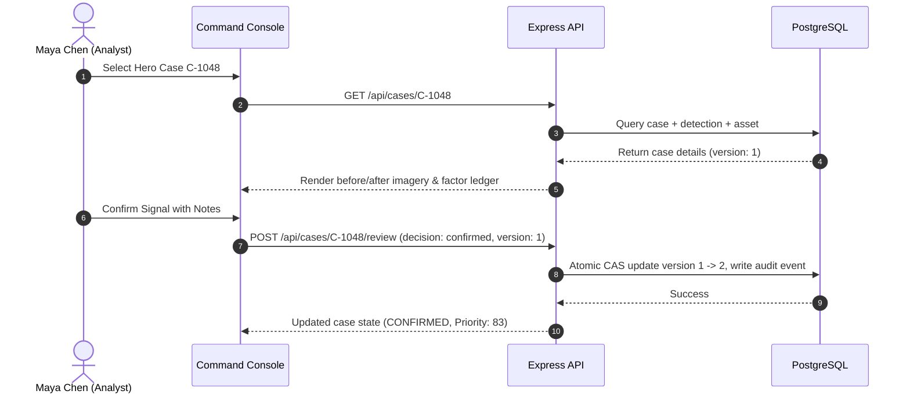

# First Run & Verification Walkthrough

Implemented Development Replay

Follow this step-by-step walkthrough to verify your installation, seed the deterministic demo dataset, and execute your first operational triage run.

---

## Step 1: Access the Web Console

Open your browser and navigate to `http://localhost:5173` (or `http://localhost:5000` in unified proxy mode). You will be presented with the DRAXELYRA authentication screen.

---

## Step 2: Sign In with a Demo Account

Use one of the pre-configured operational accounts:

| Role | Email | Password | Permissions |
| :--- | :--- | :--- | :--- |
| **Duty Officer / Analyst** | `analyst@draxelyra.local` | `demo123` | Review signals, confirm/reject cases, inspect evidence |
| **System Admin** | `admin@draxelyra.local` | `demo123` | Full system control, load demo scenarios, manage users |
| **Field Responder** | `field@draxelyra.local` | `demo123` | Update task status, upload field observations |
| **Manager** | `manager@draxelyra.local` | `demo123` | Assign tasks, review analytics, adjust priorities |

---

## Step 3: Load the Deterministic Scenario Replay

1. Sign in as `admin@draxelyra.local`.
2. Navigate to **Demo replay** in the sidebar (`/demo`).
3. Click **Load Scenario Replay** (or send `POST /api/demo/load`).
4. This idempotently seeds the **Chennai Urban Flood** dataset (`inc-chennai-demo`), critical facilities, candidate detections, and the hero case (`C-1048`).

---

## Step 4: Triage the Hero Case (`C-1048`)

1. Navigate to **Priority queue** (`/cases`).
2. Select **C-1048** (*Flood impact at Government General Hospital*).
3. Review the before/after Sentinel-2 imagery split and inspect the **Priority Ledger**:
   - Severity: Severe (22.5 pts)
   - Criticality: Hospital (25.0 pts)
   - Exposure: High (18.0 pts)
   - Urgency: 12.0 pts
   - Confidence: 55% = 5.5 pts
   - **Total Priority Score: 83**
4. Click **Review evidence** (`/review/C-1048`), add review rationale notes, and click **Confirm signal**.
5. Navigate to **Response tasks** (`/tasks`) to create and assign an immediate field verification order.
