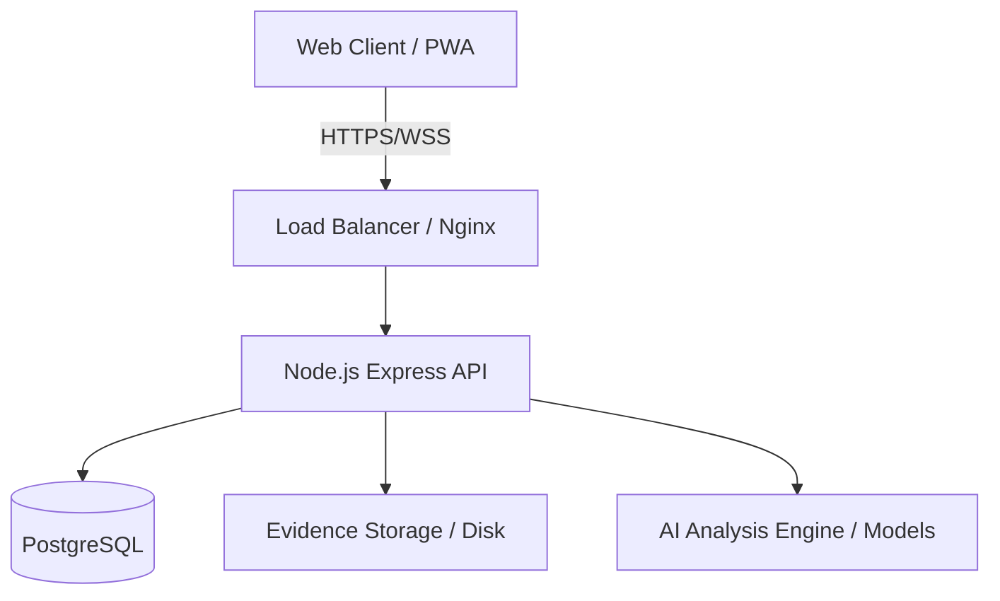

# System Architecture

Implemented

DRAXELYRA follows a classic modular monolith design for the backend and a Single Page Application (SPA) for the frontend, both designed to operate efficiently under constrained network environments typical of disaster scenarios.

## High-Level Architecture

## Key Components

1. **Frontend (React SPA)**: Built with React 18, Vite, and Wouter. Features offline-first capabilities via Service Worker and IndexedDB.
2. **Backend (Node.js/Express)**: Stateless API servers scaling horizontally, utilizing robust validation and middleware chains.
3. **Database (PostgreSQL)**: Single source of truth. Handles complex geospatial queries and transactional state machines.
4. **Storage**: Local disk for evidence uploads, with abstraction for future S3 integration.\n