# System Architecture & Subsystem Topology

Implemented

DRAXELYRA is architected as a modular, resilient operational monolith designed to process multi-hazard geospatial telemetry, execute multimodal computer vision analysis, and coordinate distributed emergency response operations under severe network degradation.

```mermaid
flowchart TB
    subgraph Clients["Presentation & Edge Layer"]
        UI["Web Command Console (React 19 / Vite / Tailwind v4)"]
        PWA["Field Verification Mobile PWA (Offline / IndexedDB)"]
        WS_CLIENT["Realtime Client (WebSocket / BroadcastChannel)"]
    end

    subgraph Gateway["Ingress & Transport Layer"]
        HTTP_GW["Express 5 HTTP Gateway (:3000)"]
        WS_GW["WebSocket Gateway (/ws)"]
        SSE_GW["Server-Sent Events Stream (/api/events)"]
        SESSION["connect-pg-simple Session Manager"]
    end

    subgraph CoreServices["Domain Service Layer"]
        INGEST["IngestionEngine (Cron Pollers / CAP Ingest)"]
        STATE_CASE["Case State Machine (FSM & CAS OCC)"]
        STATE_TASK["Task State Machine (FSM & SLA Engine)"]
        PRIORITY["Explainable 5-Factor Priority Engine"]
        AI_SVC["Damage Assessment & Multimodal AI Service"]
        ENRICH["Asset Enrichment & OSM Sync Service"]
        OUTBOX_SVC["Transactional Outbox Dispatcher"]
    end

    subgraph DataLayer["Persistence & Storage Layer"]
        DB[("PostgreSQL 15 Primary Datastore")]
        TABLES["18 Tables: cases, tasks, incidents, evidence, audit_events, outbox_events"]
        FS["Evidence & Imagery Storage (/uploads)"]
        IDB[("Browser IndexedDB (draxelyra-offline)")]
    end

    subgraph ExternalFeeds["External Intelligence Providers"]
        EXT_SACHET["SACHET India NDMA CAP Alerts"]
        EXT_USGS["USGS Hazards Earthquake Feed"]
        EXT_GDACS["GDACS Multi-Hazard Alerts"]
        EXT_FIRMS["NASA FIRMS VIIRS Active Fire Hotspots"]
        EXT_METEO["Open-Meteo & OpenWeatherMap Feeds"]
        EXT_COP["Copernicus CDSE Sentinel-1 SAR & Sentinel-2 STAC"]
        EXT_OSM["OpenStreetMap Overpass API"]
        EXT_GEMINI["Google Gemini 2.5 Flash Multimodal API"]
    end

    UI --> HTTP_GW
    UI --> WS_GW
    PWA --> HTTP_GW
    PWA --> IDB
    WS_CLIENT --> WS_GW
    WS_CLIENT --> SSE_GW

    HTTP_GW --> SESSION
    HTTP_GW --> STATE_CASE
    HTTP_GW --> STATE_TASK
    HTTP_GW --> PRIORITY
    HTTP_GW --> AI_SVC
    HTTP_GW --> ENRICH

    INGEST --> EXT_SACHET
    INGEST --> EXT_USGS
    INGEST --> EXT_GDACS
    INGEST --> EXT_FIRMS
    INGEST --> EXT_METEO
    ENRICH --> EXT_OSM
    AI_SVC --> EXT_COP
    AI_SVC --> EXT_GEMINI

    STATE_CASE --> DB
    STATE_TASK --> DB
    AI_SVC --> DB
    ENRICH --> DB
    INGEST --> DB

    DB --> OUTBOX_SVC
    OUTBOX_SVC --> WS_GW
    OUTBOX_SVC --> SSE_GW
```

---

## Subsystem Functional Responsibilities

### 1. Presentation & Field Edge Layer
- **Command Center Web Console**: Built with React 19, Tailwind CSS v4, and Radix UI primitives. Renders high-density operational views, spatial layers, and evidence review boards.
- **Field Verification PWA**: Touch-optimized interface running on mobile tablets with offline IndexedDB request buffering and camera evidence capture.
- **Realtime Channel Synchronizer**: Manages WebSocket connection lifecycle, 25s ping-pong heartbeats, and cross-tab event synchronization via the browser `BroadcastChannel` API.

### 2. Ingress & Realtime Transport Layer
- **Express 5 HTTP API Gateway**: Enforces cookie-based session authentication, RBAC middleware, payload validation, and CORS policies.
- **WebSocket Gateway (`/ws`)**: Authenticates connection upgrades against the PostgreSQL session table, maintains channel subscriptions (`global`, `incident:id`, `case:id`, `task:id`), and broadcasts domain events.
- **Server-Sent Events (`/api/events`)**: Unidirectional streaming fallback for environments restricting WebSocket traffic.

### 3. Domain Service Layer
- **Case State Machine**: Strictly validates finite state transitions (`DETECTED` to `CLOSED`), records immutable status histories, and executes atomic Compare-and-Swap (CAS) version increments.
- **Task State Machine**: Converts confirmed cases into assigned tasks, computes dynamic priority-based SLA deadlines, and tracks field verification.
- **Priority Engine**: Computes deterministic, explainable scores (0 to 100) using 5 distinct risk factors with 72-hour time decay.
- **Multimodal AI Service**: Integrates Google Gemini 2.5 Flash and deterministic baseline vision models for change detection, structuring outputs into validated Zod schemas.
- **Transactional Outbox Dispatcher**: Polls the `outbox_events` table and dispatches committed domain events asynchronously, guaranteeing zero event loss without two-phase commit overhead.

### 4. Persistence & Storage Layer
- **PostgreSQL 15 Datastore**: Primary relational source of truth managed via Drizzle ORM schemas, housing 18 structured tables with JSONB geometry columns.
- **Evidence Storage**: Local filesystem directory (`./uploads`) with magic-byte MIME verification and SHA-256 integrity checksums.
- **IndexedDB (`draxelyra-offline`)**: Client-side object store buffering field mutations during total communications blackout.
