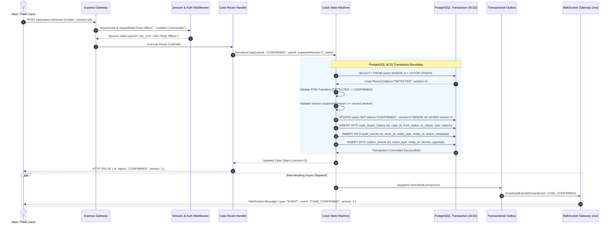

# Backend Request Lifecycle & Transaction Flow

Implemented

Every mutation request traversing the DRAXELYRA backend follows a strictly ordered, auditable lifecycle ensuring authentication, role verification, input schema validation, transactional state transition, outbox persistence, and real-time broadcast.

---

## Detailed Step-by-Step Lifecycle

1. **Transport Ingress & Cookie Parsing**: The client transmits an HTTP mutation with the signed `connect.sid` cookie.
2. **Authentication Verification**: `requireAuth` extracts the session ID, queries PostgreSQL `session` table, and deserializes user context.
3. **RBAC Authorization**: `requireRole` confirms the user's role matches permitted roles. If unauthorized, returns HTTP 403 `FORBIDDEN`.
4. **Input Schema Validation**: Route controllers validate request bodies against Zod schemas.
5. **ACID Transaction Execution**:
   - Acquires the current record from `cases`.
   - Checks that the transition from `currentStatus` to `newStatus` is valid according to `VALID_CASE_TRANSITIONS`.
   - Checks that `record.version === expectedVersion`.
   - Executes atomic SQL update with version increment.
   - Inserts audit logs into `case_status_history` and `audit_events`.
   - Inserts the domain event into `outbox_events`.
6. **HTTP Response**: The updated record is returned to the client.
7. **Asynchronous Outbox Dispatch**: The outbox worker pushes the event over WebSockets and SSE to all subscribed clients, triggering TanStack Query cache invalidations across the active incident theater.
