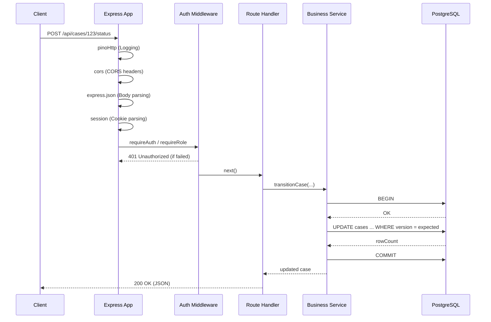

# Request Flow

Implemented

Understanding the lifecycle of an API request is critical for debugging and extending the backend. DRAXELYRA uses a strict middleware chain to process incoming HTTP requests before they reach the route handlers.

## Standard API Request Lifecycle

## Middleware Chain (Actual Audit)

Source: `artifacts/api-server/src/app.ts`

1. **pinoHttp**: Structured JSON logging. Redacts sensitive data.
2. **cors**: Configured with `origin: true` and `credentials: true`.
3. **express.json**: Parses `application/json` payloads.
4. **express.urlencoded**: Parses `application/x-www-form-urlencoded`.
5. **express-session**: Backed by `connect-pg-simple`. Uses 30-day secure HTTP-only cookies.
6. **Static File Server**: Serves files from `/uploads`.
7. **API Router**: Mounts modular route groups at `/api`.\n