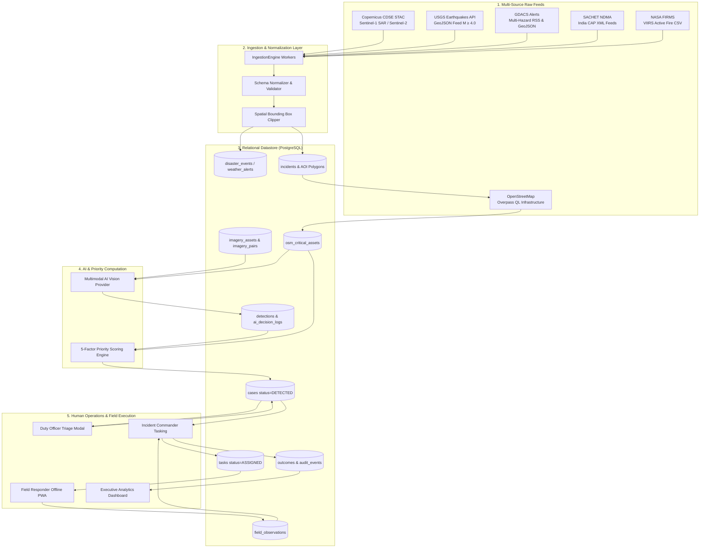

# Data Flow & End-to-End Lineage

Implemented

This document illustrates the end-to-end data lineage across DRAXELYRA—from raw external satellite swath and hazard feed ingestion to automated spatial enrichment, priority scoring, human adjudication, field verification, and after-action outcome reporting.

---

## Data Transformation Pipeline

1. **Ingestion & Deduplication**: External APIs are polled at defined intervals (5m for USGS, 10m for Weather, 15m for GDACS/FIRMS). Records are deduplicated by `externalId` to prevent duplicate incident creation.
2. **Spatial Intersection**: Ingested AOI bounding boxes query OpenStreetMap Overpass for critical nodes within a 5km radius.
3. **Multimodal Analysis**: Paired before/after satellite swaths generate structured detections with damage classification and confidence metrics.
4. **Priority Scoring**: Features are normalized to standard scales ($0	ext{--}100$) and weighted to yield an integer priority score.
5. **Transactional Lineage**: Every operational record maintains foreign keys back to its originating detection, imagery asset, and external event ID, ensuring full audit traceability.
