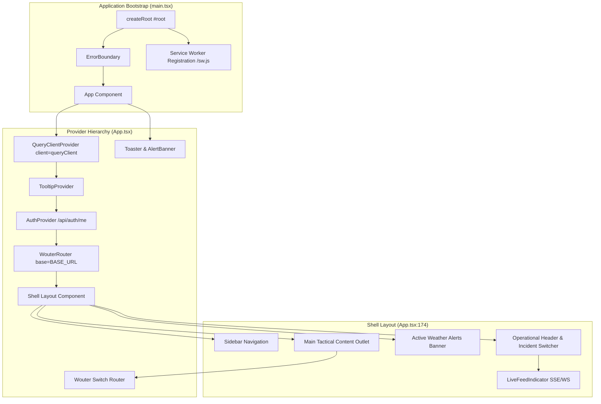

# Frontend Architecture & Provider Tree

Implemented

The DRAXELYRA frontend is a high-performance Single Page Application (SPA) built with React 19, Vite 7, Tailwind CSS v4, Wouter routing, and TanStack Query v5.

---

## Component & State Architecture

### 1. Provider Tree Ordering
1. **`QueryClientProvider`**: Configures TanStack Query server caching with standardized query keys.
2. **`TooltipProvider`**: Radix UI tooltip context for accessible operational hints.
3. **`AuthProvider`**: Deserializes session user via `GET /api/auth/me`. Enforces login redirection on 401.
4. **`WouterRouter`**: Lightweight client-side router matching 15 discrete application routes.
5. **`<Shell>`**: Enforces authentication guards, renders responsive sidebar/topbar navigation, and listens to real-time events via `useLiveEvents()`.

### 2. Styling System
- **Tailwind CSS v4**: Modular utility-first design utilizing CSS variables for theme tokens (e.g., `bg-sidebar`, `border-border`, `text-primary`).
- **Tactical Dark Palette**: High-contrast, dark-mode optimized colors designed for low-fatigue 24/7 EOC operations.
