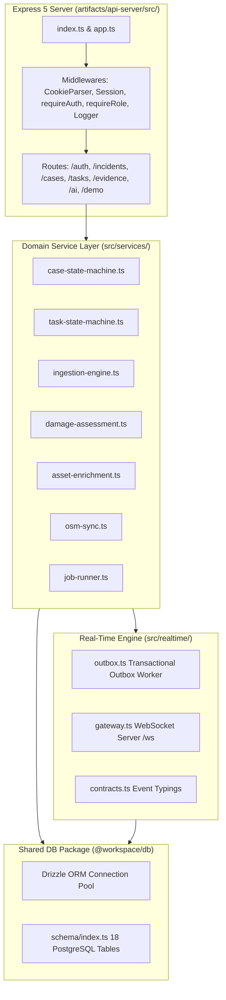

# Backend Architecture & Service Organization

Implemented

The DRAXELYRA backend is an Express 5 application organized as a modular monolith. It separates HTTP routing, middleware validation, domain services, database models, and real-time gateways into clean, decoupled modules.

---

## Source Directory Organization

- `artifacts/api-server/src/app.ts`: Express application factory and middleware configuration.
- `artifacts/api-server/src/index.ts`: HTTP and WebSocket server bootstrap on port 3000.
- `artifacts/api-server/src/routes/`: 18 modular Express route files handling specific API resources.
- `artifacts/api-server/src/services/`: Business logic, state machines, and background ingestion engines.
- `artifacts/api-server/src/ai/`: Multimodal AI providers, prompt templates, and schema validators.
- `artifacts/api-server/src/realtime/`: WebSocket gateway, connection registry, and transactional outbox.
- `lib/db/`: Drizzle ORM schema, migration scripts, and database connection pooling.
