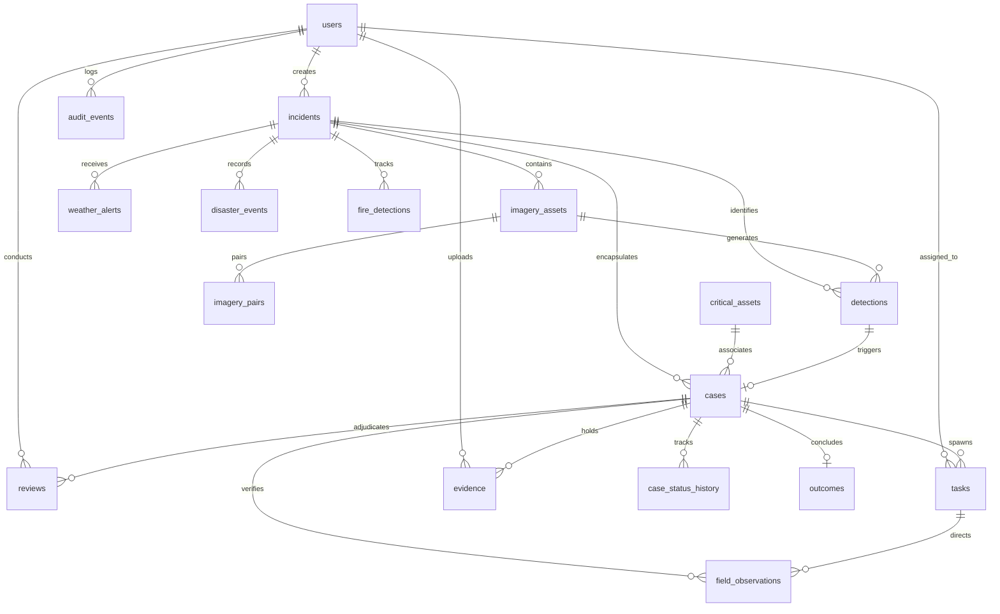

# Database Architecture & Persistence

Implemented

DRAXELYRA utilizes PostgreSQL 15 as its authoritative relational datastore, managed via TypeScript-native Drizzle ORM schemas.

---

## Schema Design Principles

1. **Structured JSONB for Geometries**: All spatial geometries (AOI polygons, asset points, detection bounds) are stored as GeoJSON in `jsonb` columns, providing flexible spatial operations without requiring external spatial database extensions.
2. **Monotonic Versioning**: Tables subject to concurrent operations (`cases`, `tasks`, `field_observations`) include a `version` integer column for Optimistic Concurrency Control.
3. **Immutable Audit Trails**: Status changes and operational decisions are recorded in append-only tables (`case_status_history`, `audit_events`, `ai_decision_logs`).
4. **Session Persistence**: Express sessions are stored directly in PostgreSQL via `connect-pg-simple`, enabling horizontal scaling across API server instances.
