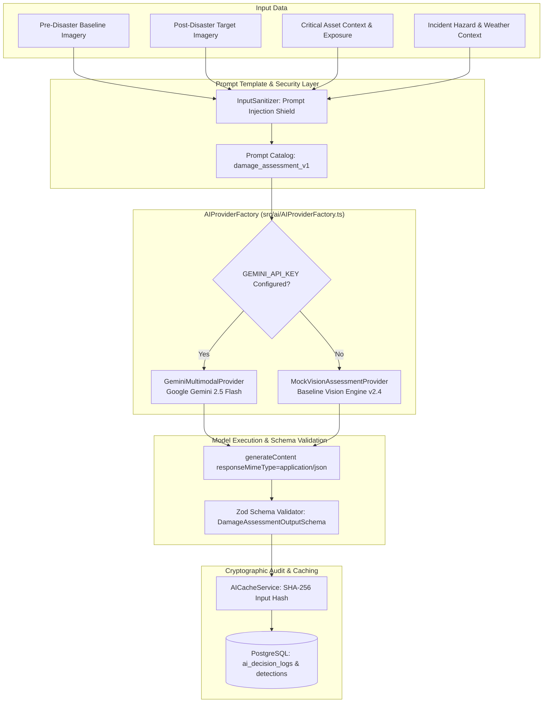

# AI / ML Intelligence Pipeline Architecture

Implemented

DRAXELYRA implements a dual-provider AI architecture designed to support real multimodal computer vision assessment when cloud API credentials are configured, while providing a fully deterministic baseline vision engine for air-gapped, offline, and scenario training environments.

---

## Dual Provider Strategy

| Provider Feature | `GeminiMultimodalProvider` | `MockVisionAssessmentProvider` |
| :--- | :--- | :--- |
| **Model Engine** | Google Gemini 2.5 Flash (`@google/genai`) | `draxelyra-cv-baseline-v2` (Deterministic CV Engine) |
| **Inference Mode** | Real Vision-Language Model (VLM) Reasoning | Synthetic SAR Backscatter & Optical Index Simulator |
| **Prerequisites** | Valid `GEMINI_API_KEY` | None (Runs offline with zero configuration) |
| **Output Format** | Validated JSON conforming to Zod Schema | Validated JSON conforming to Zod Schema |
| **Token Tracking** | Captures Prompt, Completion, and Total Tokens | Emits zero-token telemetry |
| **Latency** | 800–2500 ms (Network dependent) | 20–50 ms (Local execution) |
