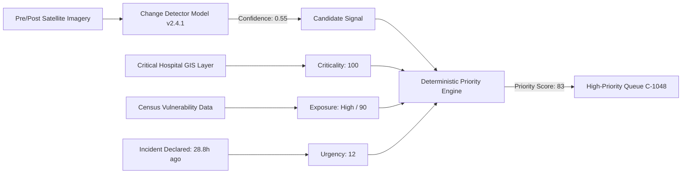

# AI / ML Architecture

Mock Adapter Active Live Service Planned

DRAXELYRA decouples **AI inference generation** from **operational emergency triage**.

---

## Dual-Score Intelligence Model

1. **Statistical Confidence (0.0 to 1.0)**: Probability that the sensor detected actual physical change.
2. **Operational Priority (0 to 100)**: Operational urgency of dispatching human response personnel.

