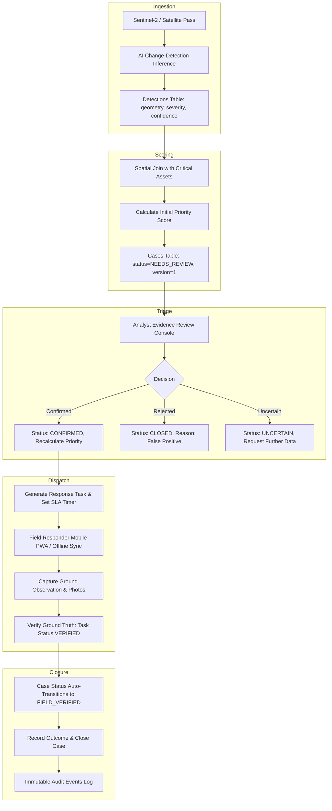

# End-to-End Data Flow

Implemented

DRAXELYRA manages the lifecycle of disaster data from satellite ingestion to closed response outcomes.

```mermaid
flowchart TD
    subgraph Ingestion
        S2[Sentinel-2 / Satellite Pass] --> Det[AI Change-Detection Inference]
        Det --> DetRec[Detections Table: geometry, severity, confidence]
    end

    subgraph Scoring
        DetRec --> Match[Spatial Join with Critical Assets]
        Match --> Score[Calculate Initial Priority Score]
        Score --> CaseRec[Cases Table: status=NEEDS_REVIEW, version=1]
    end

    subgraph Triage
        CaseRec --> ReviewUI[Analyst Evidence Review Console]
        ReviewUI --> Decision{Decision}
        Decision -->|Confirmed| Conf[Status: CONFIRMED, Recalculate Priority]
        Decision -->|Rejected| Rej[Status: CLOSED, Reason: False Positive]
        Decision -->|Uncertain| Unc[Status: UNCERTAIN, Request Further Data]
    end

    subgraph Dispatch
        Conf --> TaskGen[Generate Response Task & Set SLA Timer]
        TaskGen --> FieldSync[Field Responder Mobile PWA / Offline Sync]
        FieldSync --> GroundObs[Capture Ground Observation & Photos]
        GroundObs --> Verify[Verify Ground Truth: Task Status VERIFIED]
    end

    subgraph Closure
        Verify --> AutoTrans[Case Status Auto-Transitions to FIELD_VERIFIED]
        AutoTrans --> OutcomeRec[Record Outcome & Close Case]
        OutcomeRec --> AuditStream[Immutable Audit Events Log]
    end
```
