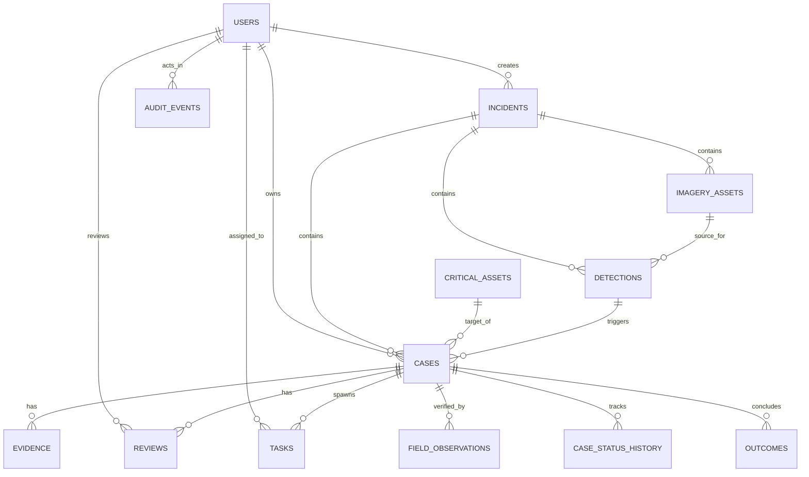

# Database Architecture

Implemented

DRAXELYRA utilizes **PostgreSQL 15** as its primary relational datastore with **Drizzle ORM** (`lib/db`) for schema definition, migrations, and query execution.

