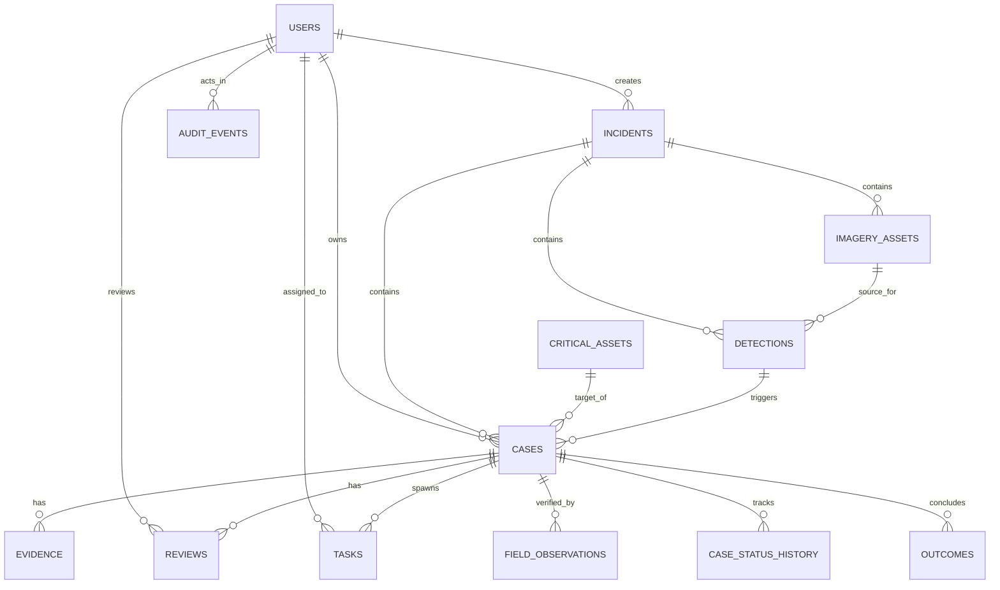

# Database Architecture

Implemented

DRAXELYRA utilizes **PostgreSQL 15** managed through **Drizzle ORM** (`lib/db`). The schema enforces referential integrity, optimistic concurrency versioning, and immutable audit logs.

