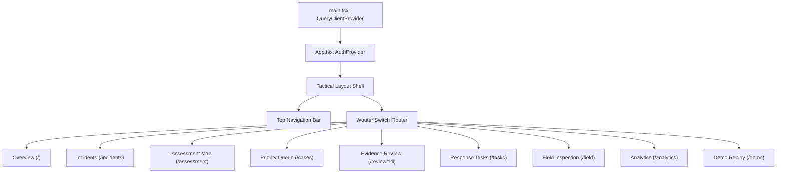

# Frontend Architecture

<span className="badge-implemented">Implemented</span>

The frontend application located at `artifacts/draxelyra` is built with **React 19**, **Vite 7**, and **Tailwind CSS v4**.

---

## 1. Runtime Entry Point (`main.tsx`)

The application bootstraps at `artifacts/draxelyra/src/main.tsx`:

```tsx
import React from 'react';
import ReactDOM from 'react-dom/client';
import { QueryClient, QueryClientProvider } from '@tanstack/react-query';
import App from './App';
import './index.css';

const queryClient = new QueryClient({
  defaultOptions: {
    queries: {
      staleTime: 1000 * 30, // 30 seconds fresh cache
      refetchOnWindowFocus: true,
      retry: 2,
    },
  },
});

ReactDOM.createRoot(document.getElementById('root')!).render(
  <React.StrictMode>
    <QueryClientProvider client={queryClient}>
      <App />
    </QueryClientProvider>
  </React.StrictMode>
);
```

---

## 2. Root Component & Layout Shell (`App.tsx`)

`artifacts/draxelyra/src/App.tsx` configures:
- **AuthProvider Context**: Wraps all child routes to ensure session validation against `/api/auth/me`.
- **Top Navigation Bar**: Renders branding, live operational counters, active route tabs, and user profile/logout controls.
- **Client-Side Routing**: Configured with **Wouter** (`Switch`, `Route`) for lightweight routing.



---

## 3. Data Layer & Caching (`lib/api-client-react`)

- **Query Hooks**: Auto-generated by Orval into `lib/api-client-react/src/index.ts` (e.g., `useListIncidents`, `useListCases`, `useGetCase`, `useListTasks`).
- **Fetch Wrapper**: `customFetch` in `lib/api-client-react/src/custom-fetch.ts` injects `credentials: 'include'` and catches offline network disconnects to enqueue mutations into IndexedDB.
- **Query Invalidation**: On successful mutation (e.g. `useReviewCase`), the query cache invalidates `['case', id]` and `['cases']` to trigger automatic background UI updates.
