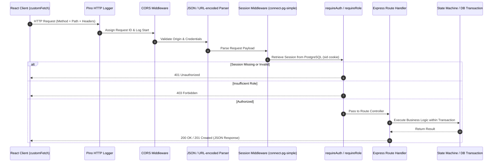

# Request Lifecycle & HTTP Pipeline

Implemented

Every HTTP request to the DRAXELYRA API traverses a structured pipeline of middlewares before reaching the business domain services.

```mermaid
sequenceDiagram
    autonumber
    participant Client as React Client (customFetch)
    participant Pino as Pino HTTP Logger
    participant Cors as CORS Middleware
    participant Body as JSON / URL-encoded Parser
    participant Sess as Session Middleware (connect-pg-simple)
    participant Auth as requireAuth / requireRole
    participant Route as Express Route Handler
    participant Service as State Machine / DB Transaction

    Client->>Pino: HTTP Request (Method + Path + Headers)
    Pino->>Cors: Assign Request ID & Log Start
    Cors->>Body: Validate Origin & Credentials
    Body->>Sess: Parse Request Payload
    Sess->>Auth: Retrieve Session from PostgreSQL (sid cookie)
    alt Session Missing or Invalid
        Auth-->>Client: 401 Unauthorized
    else Insufficient Role
        Auth-->>Client: 403 Forbidden
    else Authorized
        Auth->>Route: Pass to Route Controller
        Route->>Service: Execute Business Logic within Transaction
        Service-->>Route: Return Result
        Route-->>Client: 200 OK / 201 Created (JSON Response)
    end
```
