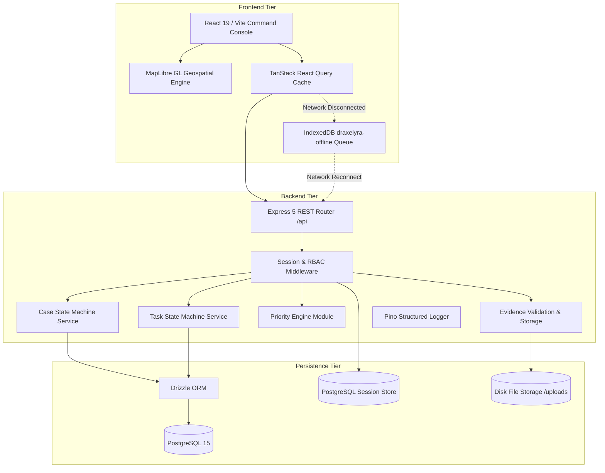

# System Architecture

<span className="badge-implemented">Implemented</span>

DRAXELYRA is architected as an **OpenAPI-first, multi-tier disaster operations platform**. It consists of a React 19 single-page application (SPA), an Express 5 REST API gateway, a PostgreSQL 15 relational database, and an IndexedDB offline mutation buffer.



---

## Workspace Structure & Packaging

The monorepo is managed with **pnpm workspaces** under the following layout:

```
DRAXELYRA-Response-OS/
├── artifacts/
│   ├── api-server/         # Express 5 backend application
│   ├── draxelyra/          # React 19 command center web console
│   └── mockup-sandbox/     # UI component prototype sandbox
├── lib/
│   ├── api-spec/           # OpenAPI 3.1 contract (openapi.yaml) & Orval codegen
│   ├── api-zod/            # Generated Zod validation schemas
│   ├── api-client-react/   # Generated TanStack Query React hooks & customFetch
│   └── db/                 # Drizzle ORM schema, relations & PostgreSQL client
├── docs/                   # Complete Technical Documentation Website (Docusaurus)
├── scripts/                # Utility scripts & build automation
├── docker-compose.yml      # Local PostgreSQL 15 container definition
├── pnpm-workspace.yaml     # Workspace configuration and supply chain constraints
└── package.json            # Root workspace scripts
```

---

## Architectural Boundaries

1. **API Contract Single Source of Truth**: The OpenAPI 3.1 specification at `lib/api-spec/openapi.yaml` defines all data schemas, request parameters, and operation IDs. Both frontend React Query hooks (`lib/api-client-react`) and backend Zod schemas (`lib/api-zod`) are generated directly from this specification.
2. **State & Concurrency Boundary**: All entity transitions for Cases and Tasks must pass through transactional state machines (`case-state-machine.ts` and `task-state-machine.ts`) enforcing Optimistic Concurrency Control (OCC) through version checking.
3. **Session & Security Boundary**: Authentication uses HTTP-only secure cookie sessions backed by the PostgreSQL `session` table via `connect-pg-simple`.
