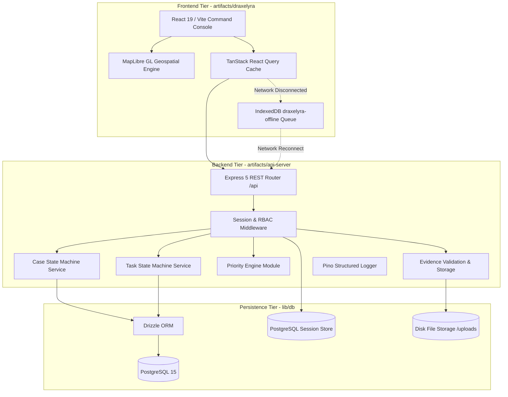

# System Architecture

<span className="badge-implemented">Implemented</span>

DRAXELYRA is architected as an **OpenAPI-first, multi-tier disaster operations platform**. It consists of a React 19 single-page application (SPA), an Express 5 REST API gateway, a PostgreSQL 15 relational database, and an IndexedDB offline mutation buffer.



---

## Monorepo Layout & Packaging Structure

The codebase is organized as a unified TypeScript monorepo managed via **pnpm workspaces**:

```
DRAXELYRA-Response-OS/
├── artifacts/
│   ├── api-server/         # Express 5 backend REST API
│   │   ├── src/
│   │   │   ├── app.ts                  # Express application bootstrap & middleware chain
│   │   │   ├── index.ts                # Server entry point (starts listener on PORT)
│   │   │   ├── lib/                    # Logger & Priority calculation formula
│   │   │   ├── middlewares/            # Session, Auth, and RBAC guards
│   │   │   ├── routes/                 # REST Route controllers (/auth, /incidents, /cases, /tasks, etc.)
│   │   │   └── services/               # Transactional State Machines (Case, Task)
│   │   └── build.mjs                   # esbuild bundle configuration
│   ├── draxelyra/          # React 19 tactical command center
│   │   ├── src/
│   │   │   ├── App.tsx                 # Main layout, Wouter routing, view components
│   │   │   ├── main.tsx                # DOM mount & QueryClientProvider setup
│   │   │   ├── components/map/         # MapLibre GL map component & GeoJSON layers
│   │   │   ├── lib/auth.tsx            # AuthProvider & useAuth hook
│   │   │   └── lib/offline-sync.ts     # IndexedDB mutation queue & event bus
│   │   └── vite.config.ts              # Vite 7 build configuration
│   └── mockup-sandbox/     # UI component preview harness
├── lib/
│   ├── api-spec/           # OpenAPI 3.1 contract (openapi.yaml) & Orval codegen
│   ├── api-zod/            # Generated Zod validation models
│   ├── api-client-react/   # Generated TanStack Query React hooks & customFetch
│   └── db/                 # Drizzle ORM schema, relations & PostgreSQL client
├── docs/                   # 19-Section Technical Documentation Suite
├── docker-compose.yml      # Local PostgreSQL 15 container definition
├── pnpm-workspace.yaml     # Workspace configuration and supply chain constraints
└── package.json            # Root workspace scripts
```

---

## Core Architectural Boundaries

1. **API Contract as Single Source of Truth**: The OpenAPI 3.1 specification at `lib/api-spec/openapi.yaml` governs all endpoints, data types, and parameters. Frontend React Query hooks (`lib/api-client-react`) and backend Zod schemas (`lib/api-zod`) are compiled directly from this specification.
2. **State & Concurrency Boundary**: All state mutations for operational Cases and Tasks must execute through transactional finite state machines (`case-state-machine.ts` and `task-state-machine.ts`) enforcing Optimistic Concurrency Control (OCC) using version checking.
3. **Session & Security Boundary**: Authentication uses HTTP-only secure cookie sessions backed by PostgreSQL table `session` via `connect-pg-simple`, validated by granular Role-Based Access Control (RBAC) middlewares.
