# Backend Middleware Stack & RBAC

Implemented

The backend implements a modular middleware pipeline enforcing security, session management, authorization, and structured JSON logging.

---

## Middleware Execution Pipeline

```mermaid
flowchart LR
    REQ[HTTP Request] --> PINO[Pino Request Logger]
    PINO --> CORS[CORS Header Middleware]
    CORS --> COOKIE[Cookie Parser]
    COOKIE --> SESS[connect-pg-simple Session]
    SESS --> AUTH[requireAuth Guard]
    AUTH --> RBAC[requireRole Guard]
    RBAC --> HANDLER[API Route Controller]
    HANDLER --> ERR[Global Error Handler]
```

---

## Authentication & RBAC Guards

**Source File**: [`artifacts/api-server/src/middlewares/auth.ts`](file:///c:/Users/Dell/Downloads/DRAXELYRA-Response-OS/DRAXELYRA-Response-OS/artifacts/api-server/src/middlewares/auth.ts)

- **`requireAuth`**: Verifies `req.session.userId` exists. If missing, responds with HTTP 401 `UNAUTHORIZED`.
- **`requireRole(...roles: string[])`**: Verifies `req.session.role` matches permitted roles. If insufficient, responds with HTTP 403 `FORBIDDEN`.
