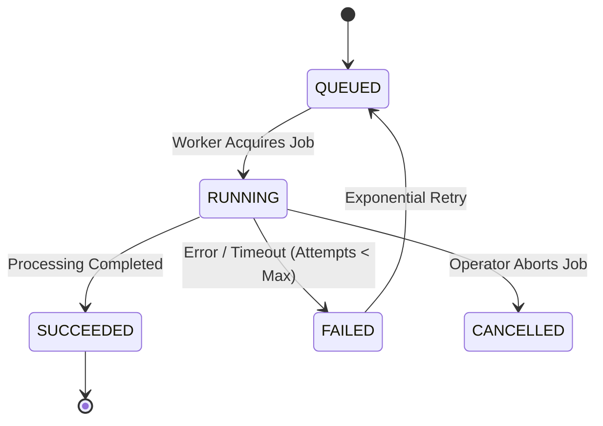

# Asynchronous Processing Jobs Engine

Implemented

Heavy computational operations—including satellite catalog discovery, raster swath download, change detection, and thumbnail generation—are executed asynchronously via the `processing_jobs` table and `JobRunner` service.

---

## Processing Job Lifecycle

---

## Job Types

- **`DISCOVERY`**: Queries external STAC APIs (Copernicus CDSE) for available Sentinel passes over an AOI.
- **`DOWNLOAD`**: Fetches optical/SAR products and stages them in local storage.
- **`PREPROCESS`**: Generates ortho-rectified GeoTIFFs and tile pyramids.
- **`CHANGE_DETECTION`**: Executes spectral difference or radar coherence analysis between paired swaths.
- **`THUMBNAIL`**: Extracts visual web preview crops for command center cards.
