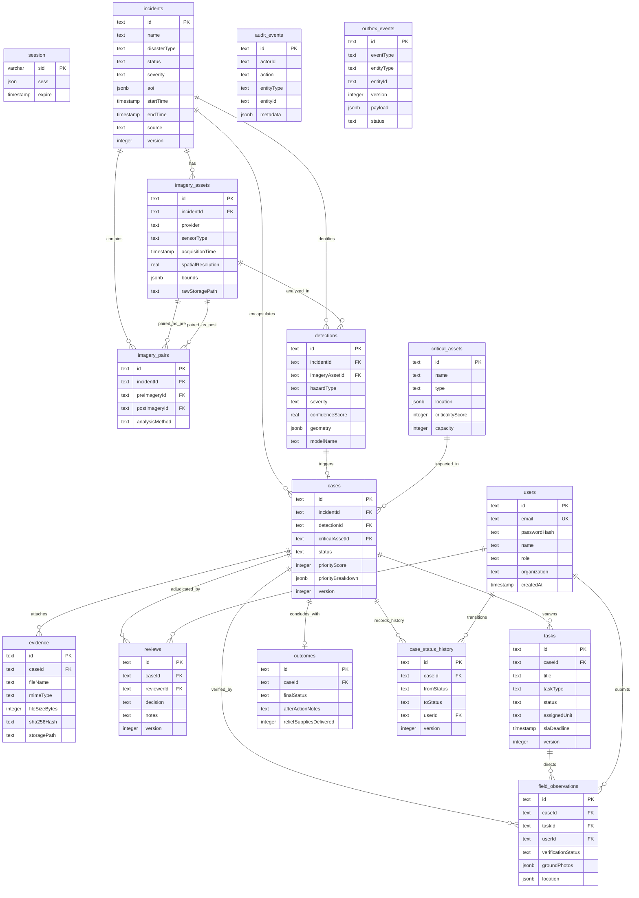

# Complete Entity-Relationship (ER) Diagram

Implemented

The complete 18-table Entity-Relationship diagram below reflects all primary keys, foreign keys, and cardinality relationships implemented in `lib/db/src/schema/index.ts`.

