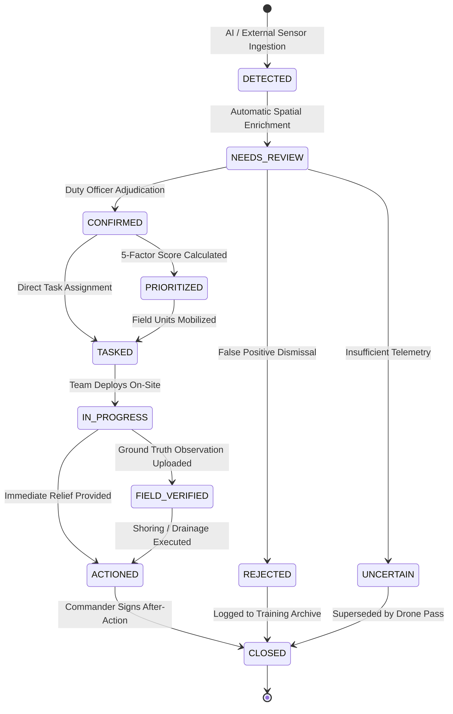

# Case Finite State Machine & Triage Lifecycle

Implemented

The **Case** is the central operational unit of work in DRAXELYRA. Cases progress through a strict 10-state Finite State Machine (FSM) defined in `artifacts/api-server/src/services/case-state-machine.ts`.

---

## Formal State Transition Table

| Current State | Allowed Next States | Required Actor Role | Guard Conditions & Actions |
| :--- | :--- | :--- | :--- |
| **`DETECTED`** | `NEEDS_REVIEW` | System / Ingestion | Generated upon ingestion of candidate anomaly; triggers OSM spatial intersection. |
| **`NEEDS_REVIEW`** | `CONFIRMED`, `REJECTED`, `UNCERTAIN` | `Duty Officer`, `Commander` | Mandatory review notes (>= 10 chars); records `reviews` entry. |
| **`CONFIRMED`** | `PRIORITIZED`, `TASKED` | `Duty Officer`, `Commander` | Computes explainable priority score (0 to 100); attaches priority breakdown. |
| **`PRIORITIZED`** | `TASKED` | `Field Lead`, `Commander` | Generates child `tasks` record with dynamic SLA deadline. |
| **`TASKED`** | `IN_PROGRESS` | `Field Lead`, `Responder` | Response team mobilized to target coordinates. |
| **`IN_PROGRESS`** | `FIELD_VERIFIED`, `ACTIONED` | `Field Responder` | Ground observation received with GPS coordinate and photo proof. |
| **`FIELD_VERIFIED`**| `ACTIONED` | `Field Lead` | Mitigation action completed (e.g., pump installed, levee reinforced). |
| **`ACTIONED`** | `CLOSED` | `Incident Commander` | Final outcome recorded in `outcomes` table. |
| **`REJECTED`** | `CLOSED` | `Duty Officer`, `Commander` | False positive logged into `ai_evaluation_dataset` for model tuning. |
| **`UNCERTAIN`** | `CLOSED` | `Duty Officer`, `Commander` | Archived pending higher-resolution reconnaissance. |
| **`CLOSED`** | *(None - Terminal)* | None | Immutable terminal state. |
