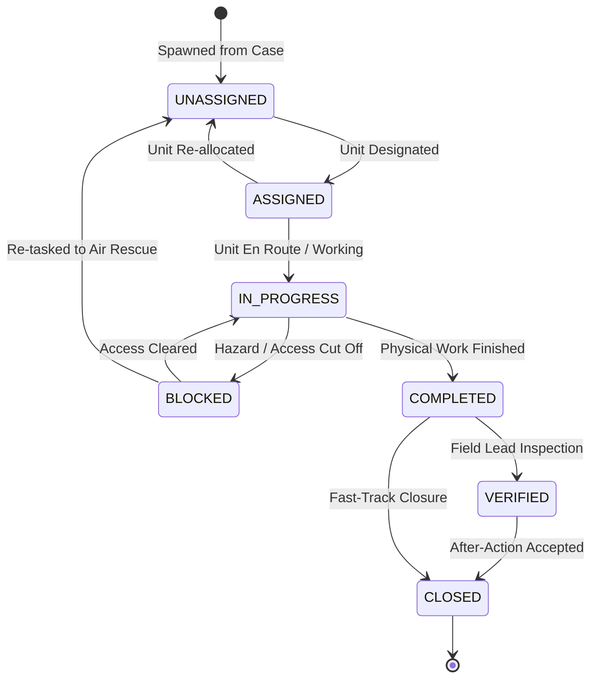

# Task State Machine & Dynamic SLA Calculation

<span className="badge-implemented">Implemented</span>

Tasks represent discrete physical or analytical work orders spawned from confirmed crisis cases. Tasks are governed by a 7-state FSM in `artifacts/api-server/src/services/task-state-machine.ts`.



---

## Dynamic SLA Calculation Engine

**Source File**: [`artifacts/api-server/src/services/task-state-machine.ts:80`](file:///c:/Users/Dell/Downloads/DRAXELYRA-Response-OS/DRAXELYRA-Response-OS/artifacts/api-server/src/services/task-state-machine.ts#L80-L98)

When a task is created from a confirmed case, its Service Level Agreement (SLA) deadline is computed dynamically from the parent case's Priority Score ($P$):

| Priority Score Range | Response Tier | SLA Window | Target Operational Benchmark |
| :--- | :--- | :--- | :--- |
| **P &ge; 85 (Critical)** | Tier 1 (Critical) | **4 Hours** | Immediate life-safety, hospital power loss, flood breach. |
| **65 to 84 (High)** | Tier 2 (High) | **8 Hours** | Bridge structural washouts, major transit arterial cut. |
| **40 to 64 (Moderate)** | Tier 3 (Moderate) | **16 Hours** | Residential neighborhood inundation, shelter supply delivery. |
| **0 to 39 (Routine)** | Tier 4 (Routine) | **36 Hours** | Secondary debris clearance, agricultural drainage survey. |


```typescript
export function computeSlaDeadline(priorityScore: number): Date {
  const now = Date.now();
  let hours = 36;
  if (priorityScore >= 85) hours = 4;
  else if (priorityScore >= 65) hours = 8;
  else if (priorityScore >= 40) hours = 16;

  return new Date(now + hours * 60 * 60 * 1000);
}
```
