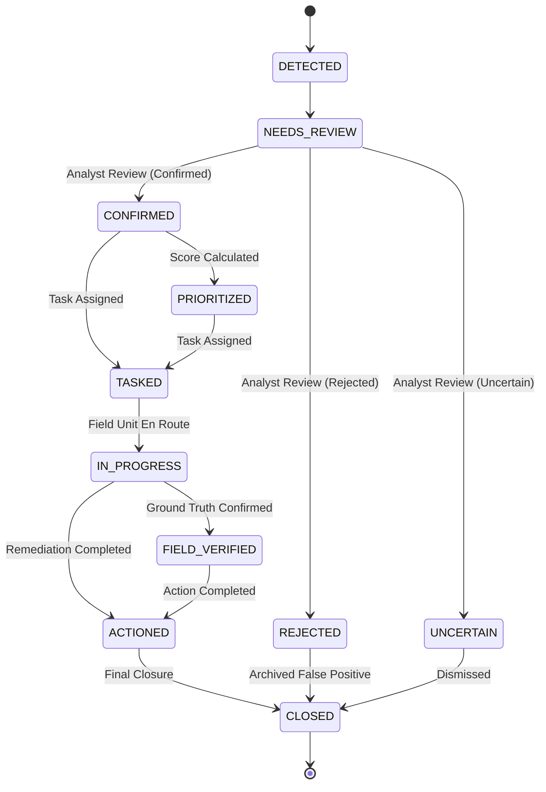

# Case Lifecycle & Finite State Machine

Implemented

Governed by the state machine in `artifacts/api-server/src/services/case-state-machine.ts`.

```mermaid
stateDiagram-v2
    [*] --> DETECTED
    DETECTED --> NEEDS_REVIEW
    NEEDS_REVIEW --> CONFIRMED: Analyst Review (Confirmed)
    NEEDS_REVIEW --> REJECTED: Analyst Review (Rejected)
    NEEDS_REVIEW --> UNCERTAIN: Analyst Review (Uncertain)
    
    CONFIRMED --> PRIORITIZED: Score Calculated
    CONFIRMED --> TASKED: Task Assigned
    PRIORITIZED --> TASKED: Task Assigned
    
    TASKED --> IN_PROGRESS: Field Unit En Route
    IN_PROGRESS --> FIELD_VERIFIED: Ground Truth Confirmed
    IN_PROGRESS --> ACTIONED: Remediation Completed
    FIELD_VERIFIED --> ACTIONED: Action Completed
    
    ACTIONED --> CLOSED: Final Closure
    REJECTED --> CLOSED: Archived False Positive
    UNCERTAIN --> CLOSED: Dismissed
    CLOSED --> [*]
```
