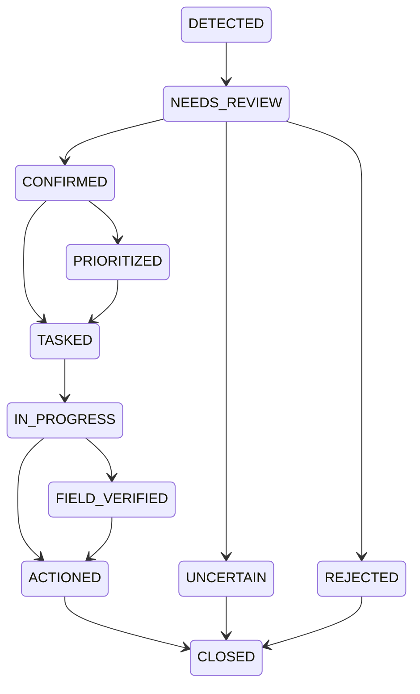

# Case Lifecycle

Implemented

## State Machine
The core domain logic of a case follows a strict state machine implemented in `services/case-state-machine.ts`.

## Transition Logic
Transitions are handled by `transitionCase(caseId, newStatus, userId, expectedVersion, notes?, extraUpdates?)`.
This function:
1. Begins a transaction (`db.transaction()`).
2. Checks `expectedVersion` to enforce OCC. Throws `VERSION_CONFLICT` if mismatched.
3. Validates the transition (e.g., cannot go from `CLOSED` back to `IN_PROGRESS`). Throws `INVALID_TRANSITION` on failure.
4. Updates the case status and increments the version.
5. Inserts an entry into `caseStatusHistory`.
6. Emits an audit event into `auditEvents`.

## Auto-Transitions
- **Creating a task** automatically transitions a case to `TASKED`.
- **Task verification** automatically transitions a case to `FIELD_VERIFIED`.
