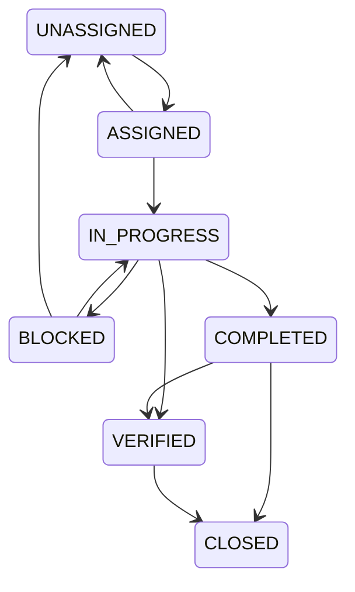

# Tasks, Evidence, and Audit

Implemented

## Task State Machine
Implemented in `services/task-state-machine.ts`:

## SLA Calculation
When a task is created (`POST /api/tasks`), SLA is determined by priority:
- Priority >= 75 → 30min
- Priority >= 45 → 2h
- Else → 8h
`escalationAt` is set to `dueAt + 30min`.

## Evidence Upload Pipeline
Located in `routes/evidence.ts`:
- Uses **Multer** with memory storage and a 50MB limit.
- Validates MIME types: `image/jpeg`, `image/png`, `image/webp`, `video/mp4`.
- Checks magic bytes to prevent spoofing (JPEG=`FFD8FF`, PNG=`89504E47`, WebP=`RIFF+WEBP`, MP4=`ftyp`).
- Generates a SHA-256 hash.
- Prevents path traversal and writes securely to the `uploads/` directory.

## Audit Events
All critical actions record an entry in the `auditEvents` table. These include actor ID, entity type/ID, action, and JSON metadata.
