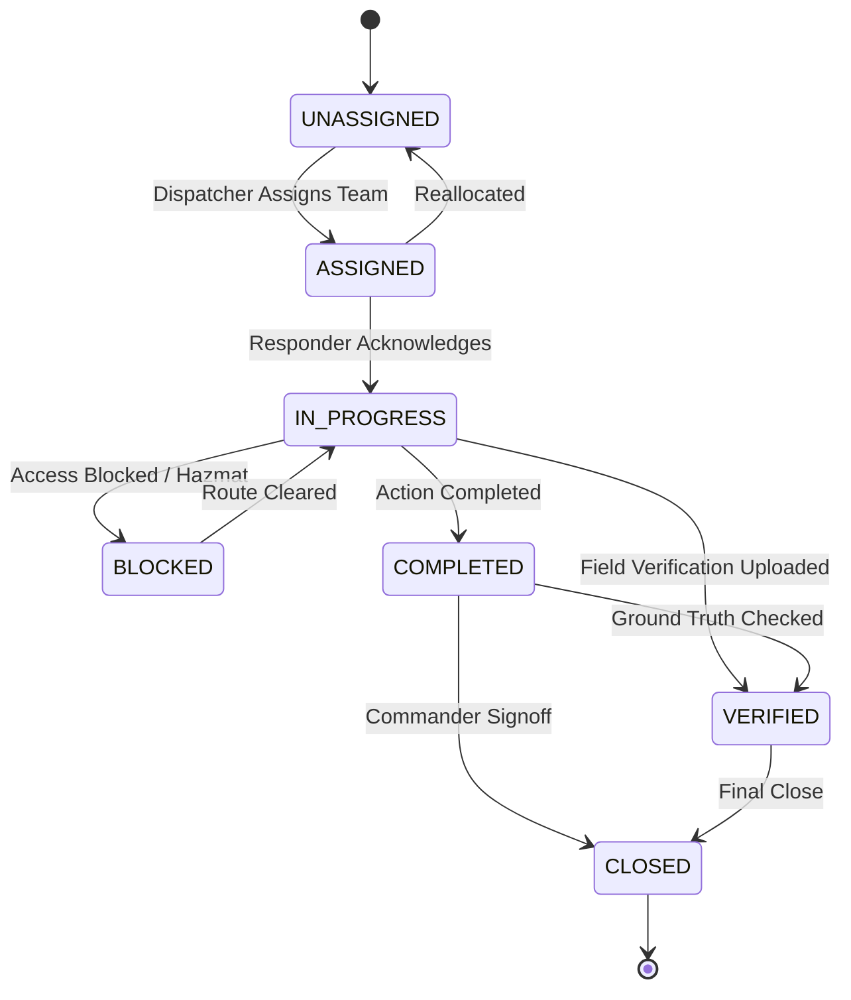

# Task Management & SLA Escalations

Implemented

Tasks represent accountable operational response orders.

```mermaid
stateDiagram-v2
    [*] --> UNASSIGNED
    UNASSIGNED --> ASSIGNED: Dispatcher Assigns Team
    ASSIGNED --> IN_PROGRESS: Responder Acknowledges
    ASSIGNED --> UNASSIGNED: Reallocated
    IN_PROGRESS --> BLOCKED: Access Blocked / Hazmat
    IN_PROGRESS --> COMPLETED: Action Completed
    IN_PROGRESS --> VERIFIED: Field Verification Uploaded
    BLOCKED --> IN_PROGRESS: Route Cleared
    COMPLETED --> VERIFIED: Ground Truth Checked
    COMPLETED --> CLOSED: Commander Signoff
    VERIFIED --> CLOSED: Final Close
    CLOSED --> [*]
```
