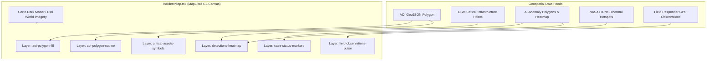

# WebGL Map Engine & Multi-Layer Rendering

Implemented

The primary geospatial interface in DRAXELYRA is powered by **MapLibre GL JS** encapsulated via `react-map-gl/maplibre` in `artifacts/draxelyra/src/components/map/IncidentMap.tsx`.

---

## Layer Configuration & Color Semantics

| Layer Identifier | Geometry Type | Data Source | Styling Rules & Tactical Semantics |
| :--- | :--- | :--- | :--- |
| `aoi-fill` | `Polygon` | `incident.aoi` | Fill `#259184`, Opacity `0.08`. Delineates operational response theater. |
| `aoi-outline` | `LineString` | `incident.aoi` | Color `#259184`, Width `2px`, DashArray `[2, 2]`. |
| `detections-heat`| `Point` | `detections` | Kernel density weighting based on model confidence score (0.0 to 1.0). |
| `critical-assets`| `Point` | `critical_assets` | Red circle for Hospitals (`#E53E3E`), Blue for Substations (`#3182CE`), Orange for Bridges (`#DD6B20`). |
| `cases-status` | `Point` | `cases` | Yellow for `NEEDS_REVIEW`, Teal for `CONFIRMED`, Crimson for `REJECTED`, Grey for `CLOSED`. |
| `field-obs` | `Point` | `field_observations`| Green pulsing beacon for verified ground truth reports with attached photos. |
