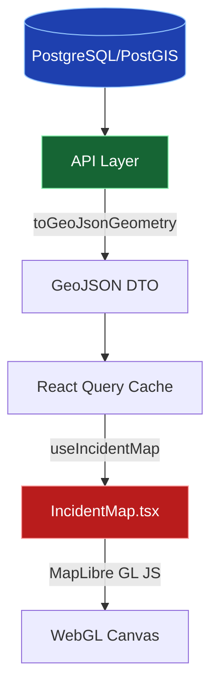

# Map Engine Implementation
<span className="badge-implemented">Implemented</span>

The DRAXELYRA platform incorporates a high-performance, WebGL-accelerated map engine based on `react-map-gl`, `maplibre`, and `maplibre-gl`. It serves as the primary visual interface for command center operators and field responders.

## Architecture

The map engine is built using an open-source geospatial stack, utilizing OpenStreetMap raster tiles for basemaps and GeoJSON for dynamic feature overlays.



## Backend Data Transformation

All coordinates are stored in the database in WGS84 (EPSG:4326). When fetching the incident map endpoint (`/api/incidents/:id/map`), the backend aggregates multiple entity types into a unified response of `FeatureCollection` objects.

**Source File:** `backend/src/utils/geo.ts`
```typescript
export function toGeoJsonGeometry(loc: { lat: number; lng: number }): GeoJSON.Point {
  return {
    type: 'Point',
    coordinates: [loc.lng, loc.lat] // GeoJSON strictly requires [longitude, latitude]
  };
}
```

## React Map Component

**Source File:** `apps/web/src/components/IncidentMap.tsx`

The map leverages `react-map-gl/maplibre` to render layers interactively. Basemap tiles are fetched from OSM:
`https://tile.openstreetmap.org/{z}/{x}/{y}.png`

### Layer Definitions

The map renders 6 distinct GeoJSON layers to represent the operational theater:

| Layer Name | Visual Treatment | Description |
|---|---|---|
| **AOI (Area of Interest)** | Fill: `#259184` (0.1 opacity) + Dashed Border | Represents the bounding geometry of the disaster. |
| **Critical Assets** | Circle: Radius 8, `#4a5568`, White Stroke | High-value targets (hospitals, shelters, bridges). |
| **Detections** | Circle: Radius 4, `#cd372f` (0.6 opacity) | Raw AI detections before analyst verification. |
| **Cases (Needs Review)** | Circle: Radius 6, `#EFAC30` | Unverified cases awaiting analyst triage. |
| **Cases (Confirmed)** | Circle: Radius 6, `#259184` | Actionable, verified impact zones. |
| **Cases (Rejected/Closed)** | Circle: Radius 6, `#cd372f` / `#8b9b95` | Dismissed or resolved incidents. |
| **Field Observations** | Circle: Radius 5, `#259184`, White Stroke | Reports directly uploaded by responders. |

### API Response Schema

The `['incident-map', incidentId]` query fetches data matching the following schema:

```json
{
  "aoi": {
    "type": "Feature",
    "geometry": { "type": "Polygon", "coordinates": [...] },
    "properties": { "name": "Chennai Basin" }
  },
  "cases": { "type": "FeatureCollection", "features": [...] },
  "criticalAssets": { "type": "FeatureCollection", "features": [...] },
  "detections": { "type": "FeatureCollection", "features": [...] },
  "fieldObservations": { "type": "FeatureCollection", "features": [...] }
}
```

### Interactive Features

- **Click Handlers:** Clicking a case feature automatically transitions the user to `/cases/${id}`. Clicking a critical asset triggers a popup alerting the user of the asset's name and type.
- **Layout Modes:** The component supports a `compact` mode (190px height) for sidebars and dashboards, and a `full` mode (440px height) for dedicated map views.
- **CRS Projection:** While data is transferred in EPSG:4326, the WebGL canvas dynamically projects coordinates to Web Mercator (EPSG:3857) for rendering.
