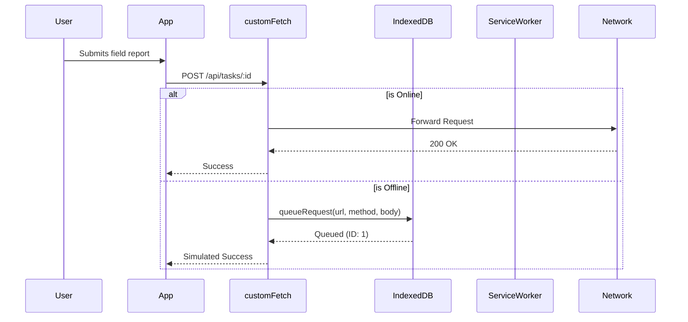

# Offline Synchronization
<span className="badge-implemented">Implemented</span>

To guarantee continuity of operations in degraded or entirely disconnected environments, DRAXELYRA implements a robust Service Worker and IndexedDB-based queueing mechanism.

## Architecture



## Service Worker Implementation

**Source File:** `apps/web/public/sw.js`

The Service Worker handles asset caching and network intercepting.
- **Cache Name:** `draxelyra-v1`
- **Install Phase:** Caches the root `/` and static assets. Calls `skipWaiting()` to immediately activate.
- **Fetch Logic:** Bypasses `/api/` requests (handled by customFetch) and non-GET requests. For all other GET requests, it uses a cache-first, network-fallback strategy.

## IndexedDB Queue

**Source File:** `apps/web/src/lib/offline-sync.ts`

The platform utilizes IndexedDB to persist mutations when offline.

- **Database:** `draxelyra-offline` (Version 1)
- **Store:** `syncQueue` (keyPath: `id`, `autoIncrement: true`)

Core functions exported for queue management:
```typescript
export async function getOfflineDB(): Promise<IDBPDatabase> { ... }
export async function queueRequest(url: string, method: string, body: any): Promise<number> { ... }
export async function getQueue(): Promise<QueueItem[]> { ... }
export async function clearQueueItem(id: number): Promise<void> { ... }
```

## Network Interceptor

**Source File:** `lib/api-client-react/src/custom-fetch.ts`

The custom fetch wrapper acts as the application's circuit breaker. If `!navigator.onLine` evaluates to true, any non-GET request is automatically serialized and passed to `queueRequest`. The UI is immediately updated optimistically.

## Conflict Resolution & Status

The `/field` page provides a dedicated offline status widget. It queries `getQueue()` to display the pending operations count. 
If an optimistic update causes a conflict upon syncing (e.g., a `409 VERSION_CONFLICT` from the backend), the application pauses the queue and prompts the user for conflict resolution, displaying the server's current state alongside the local queued state.
