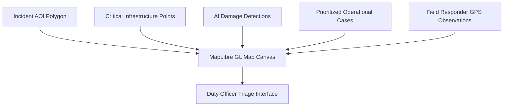

# Geospatial Overview

Implemented

Geospatial data forms the operational canvas of DRAXELYRA. The platform integrates satellite observations, cadastral facility layers, and field tracks into unified interactive maps.

