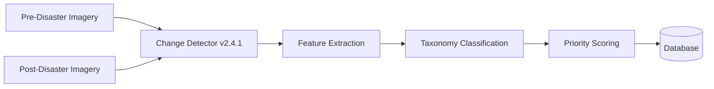

# AI/ML Intelligence Pipeline
Mock Adapter Active Planned

The AI/ML Intelligence pipeline provides rapid analysis of bi-temporal satellite imagery to generate actionable damage assessments.

> [!IMPORTANT]
> The current system utilizes a mock adapter simulating the planned `change-detector/v2.4.1` model. The outputs are deterministic for the Chennai Urban Flood demo scenario but structurally match the planned production payload.

## Pipeline Architecture

## Damage Taxonomy

The model classifies damage into specific, actionable tiers. Each tier carries a baseline score used in downstream priority calculations.

| Class | Baseline Score | Definition |
|---|---|---|
| **Destroyed** | 100 | Complete structural failure, unrecoverable. |
| **Severe** | 75 | Major structural damage, uninhabitable. |
| **Moderate** | 45 | Significant damage, requires extensive repair. |
| **Uncertain** | 35 | Anomalies detected but occluded (e.g., cloud cover/shadows). |
| **Minor** | 20 | Superficial damage, structure intact. |
| **No damage** | 0 | Baseline state maintained. |

## Confidence vs Priority Divergence

The model outputs a `confidence` score (0.0 to 1.0) indicating the statistical certainty of the prediction.

The Intelligence Pipeline intentionally separates AI *confidence* from Operational *priority*.
For example, a detection on a **Hospital** with a mere **55% confidence** may result in a **Priority 83** task, because the potential operational cost of missing hospital damage is catastrophic. Conversely, a **Commercial** building with **96% confidence** may only trigger a **Priority 28** task.

## Demo Scenario: Chennai Urban Flood

The deterministic mock adapter replays a carefully curated dataset representing the Chennai Urban Floods. It seeds:
- 120+ raw detections
- 15 Critical Assets
- 1 "Hero" Case (C-1048) demonstrating complex multi-asset occlusion.

## Future Roadmap

1. **gRPC Inference Service:** Transitioning from REST to a high-throughput gRPC stream for sub-second tile processing.
2. **Active Learning Loop:** Integrating analyst feedback (Confirmed/Rejected/Uncertain) directly into periodic LoRA fine-tuning runs.
3. **Drone Telemetry Integration:** Extending bi-temporal satellite ingestion to accept oblique drone footage for localized verification.
