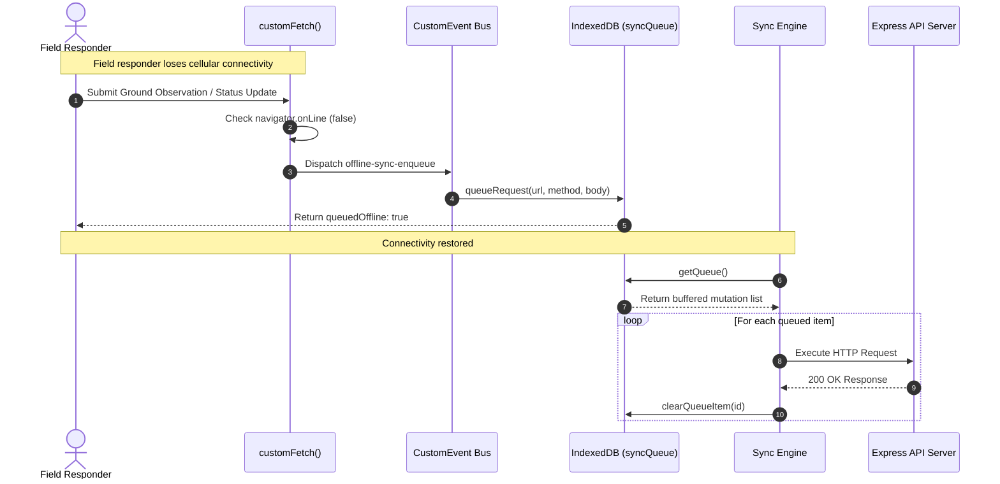

# Offline Architecture & Lifecycle

Implemented

```mermaid
sequenceDiagram
    autonumber
    actor Responder as Field Responder
    participant Fetch as customFetch()
    participant Event as CustomEvent Bus
    participant IDB as IndexedDB (syncQueue)
    participant Sync as Sync Engine
    participant API as Express API Server

    Note over Responder,Fetch: Field responder loses cellular connectivity
    Responder->>Fetch: Submit Ground Observation / Status Update
    Fetch->>Fetch: Check navigator.onLine (false)
    Fetch->>Event: Dispatch offline-sync-enqueue
    Event->>IDB: queueRequest(url, method, body)
    IDB-->>Responder: Return queuedOffline: true
    
    Note over Responder,Sync: Connectivity restored
    Sync->>IDB: getQueue()
    IDB-->>Sync: Return buffered mutation list
    loop For each queued item
        Sync->>API: Execute HTTP Request
        API-->>Sync: 200 OK Response
        Sync->>IDB: clearQueueItem(id)
    end
```
