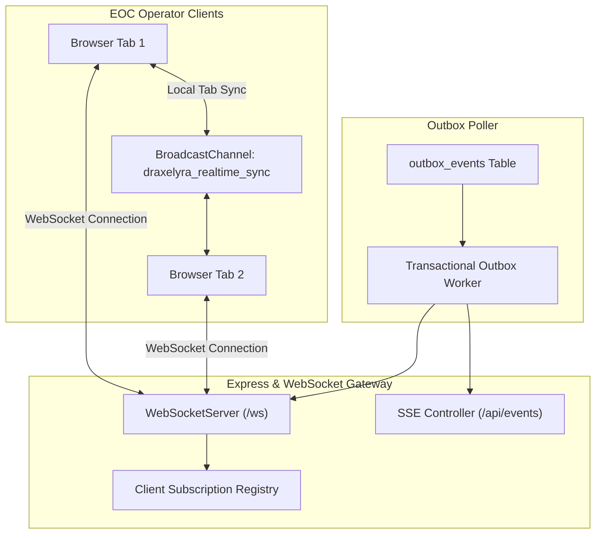

# Real-Time Messaging Architecture & Channels

Implemented

DRAXELYRA implements a hybrid real-time communication fabric combining **WebSockets (`/ws`)**, **Server-Sent Events (`/api/events`)**, and the browser **`BroadcastChannel` API**.

---

## Protocol Comparison

| Capability | WebSocket (`/ws`) | Server-Sent Events (`/api/events`) | BroadcastChannel API |
| :--- | :--- | :--- | :--- |
| **Direction** | Bidirectional (Duplex) | Unidirectional (Server $	o$ Client) | Client-side Cross-Tab Sync |
| **Authentication** | Session cookie on WS handshake | Session cookie on HTTP stream | Same-origin browser memory |
| **Heartbeat** | 25-second Ping/Pong | 15-second SSE comment `:keepalive` | None (Local process) |
| **Primary Use** | Real-time case updates & alerts | Firewall-restricted fallback | Prevents redundant WS connections |
