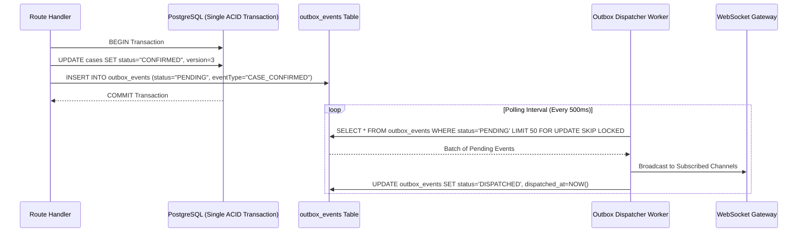

# Transactional Outbox Pattern & Zero Event Loss

Implemented

To guarantee that domain events are never lost if the server restarts or network partitions occur during an API call, DRAXELYRA utilizes the **Transactional Outbox Pattern** in `artifacts/api-server/src/realtime/outbox.ts`.

