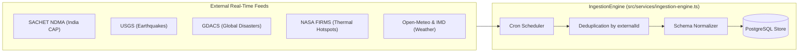

# Multi-Source Disaster Telemetry Framework

Implemented

DRAXELYRA implements an automated, resilient ingestion framework located in `artifacts/api-server/src/services/ingestion-engine.ts`. It polls national and global emergency monitoring agencies on deterministic cron schedules.

---

## Feed Polling Schedules & Endpoints

| Provider | Telemetry Type | Endpoint / Protocol | Cron Frequency | Deduplication Key |
| :--- | :--- | :--- | :--- | :--- |
| **SACHET NDMA** | Common Alerting Protocol (CAP) | RSS/XML Feed | Every 10 min | `sachet_<identifier>` |
| **USGS** | Seismic Events (M $ge$ 4.0) | GeoJSON HTTP Feed | Every 5 min | `usgs_<id>` |
| **GDACS** | Floods, Cyclones, Volcanoes | RSS & GeoJSON Feed | Every 15 min | `gdacs_<eventid>` |
| **NASA FIRMS** | VIIRS Active Thermal Hotspots | CSV Data Stream | Every 15 min | `firms_<latitude>_<longitude>_<acq_time>` |
| **Open-Meteo** | Hourly Precipitation & Wind | RESTful JSON API | Every 10 min | Spatial Centroid + Hour |
