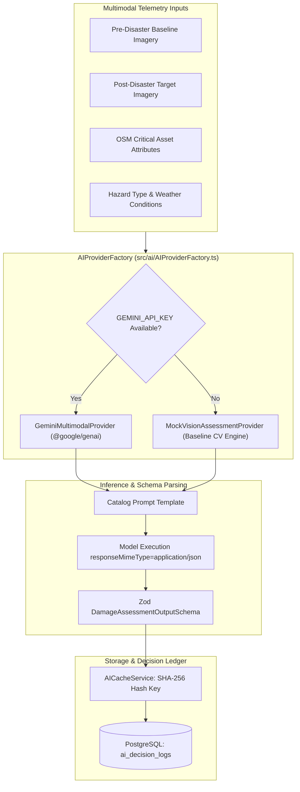

# Multimodal AI Architecture & Pipeline

Implemented

DRAXELYRA incorporates a dual-provider multimodal AI architecture designed to execute satellite change detection, structural damage classification, and prompt-driven impact reasoning.

