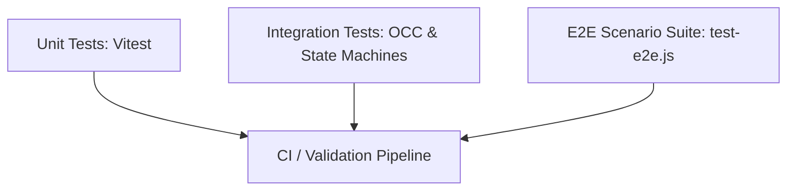

# Testing Strategy Overview

Implemented

The testing framework employs **Vitest** for unit tests and TypeScript-driven end-to-end API suites.

```mermaid
flowchart TD
    A[Unit Tests: Vitest] --> D[CI / Validation Pipeline]
    B[Integration Tests: OCC & State Machines] --> D
    C[E2E Scenario Suite: test-e2e.js] --> D
```
