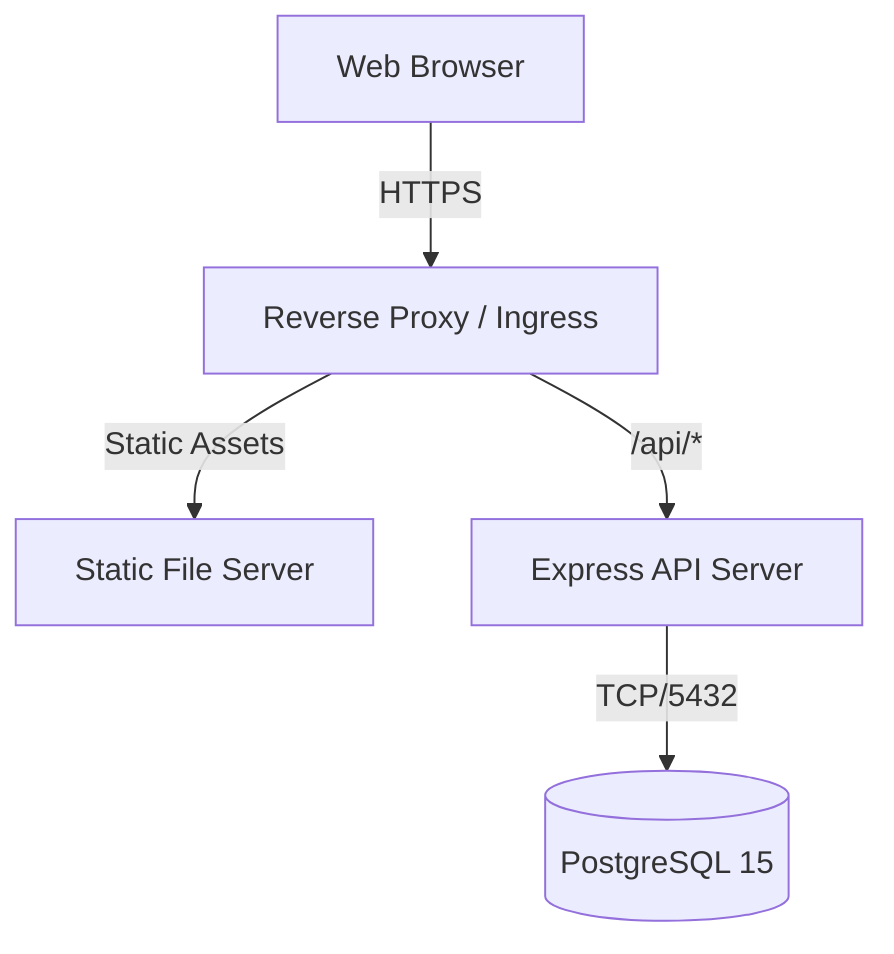

# Deployment Architecture and Strategies

<span className="badge-implemented">Implemented</span>

The DRAXELYRA platform is designed to be deployed across a variety of environments ranging from local development machines to scalable production clusters. This document details the infrastructure requirements, configuration variables, and procedural steps for deploying the DRAXELYRA platform.

## Infrastructure Architecture

At its core, the platform follows a modular monolith approach wrapped in a workspace-based monorepo. The primary services include:
1.  **API Server (Backend)**: Express 5.2 application providing the core REST capabilities and database interactions.
2.  **Web Client (Frontend)**: React 19 application built via Vite.
3.  **PostgreSQL Database**: Persistent storage for all entities.



## Local Development Deployment

For local development, the platform utilizes Docker Compose to manage dependencies (like PostgreSQL) while running the application services directly on the host using `pnpm`.

### Docker Compose Configuration

File: `docker-compose.yml`

```yaml
services:
  postgres:
    image: postgres:15-alpine
    container_name: draxelyra-postgres
    environment:
      POSTGRES_USER: postgres
      POSTGRES_PASSWORD: postgres
      POSTGRES_DB: draxelyra
    ports: ["5433:5432"]
    volumes: [postgres-data:/var/lib/postgresql/data]
    restart: unless-stopped
volumes:
  postgres-data:
```

### Startup Procedure

1.  **Initialize Database Services**:
    ```bash
    docker compose up -d
    ```
2.  **Migrate Schema**:
    Push the Drizzle ORM schema to the active database instance.
    ```bash
    pnpm --filter @workspace/db run push
    ```
3.  **Start Development Server**:
    Launch the Vite development server and the backend API server concurrently.
    ```bash
    pnpm run dev
    ```

### Dev Server Proxy Setup

During development, the Vite server operates on port `5173` and proxies all requests prefixed with `/api` to the Express server running on port `3000`. This bypasses CORS issues and perfectly mimics production routing behavior.

File: `artifacts/draxelyra/vite.config.ts`
```typescript
export default defineConfig({
  server: {
    port: 5173,
    proxy: {
      '/api': {
        target: 'http://localhost:3000',
        changeOrigin: true
      }
    }
  }
});
```

## Production Deployment

Production deployments bundle the frontend into static assets and compile the backend into a lightweight Node.js executable script.

### Build Process

The production build step executes across all workspace packages:

```bash
pnpm build
```

1.  **Backend Target**: `artifacts/api-server/dist/index.mjs` (bundled via esbuild).
2.  **Frontend Target**: `artifacts/draxelyra/dist/public/` (bundled via Vite).

In production, the Express backend serves the static frontend assets from the `public` directory, simplifying deployment down to a single Node.js process and a PostgreSQL database.

### Environment Configuration

The following environment variables govern the deployment:

| Variable | Description | Required | Default |
|----------|-------------|----------|---------|
| `DATABASE_URL` | PostgreSQL connection string | Yes | - |
| `PORT` | Server port (validated > 0) | Yes | `3000` |
| `SESSION_SECRET` | Express session cryptographic secret | No | `draxelyra_default_secret` |
| `NODE_ENV` | Application environment flag | No | `development` |
| `LOG_LEVEL` | Pino logger verbosity level | No | `info` |
| `VITE_PORT` | Vite development server port | No | `5173` |
| `BASE_PATH` | Frontend base routing path | No | `/` |

### Cloud / Replit Deployment

When deploying to PaaS providers (like Replit or Render), the platform utilizes a reverse proxy configured by the provider. Ensure that `DATABASE_URL` points to a managed PostgreSQL instance and that the start command triggers `node artifacts/api-server/dist/index.mjs`.
