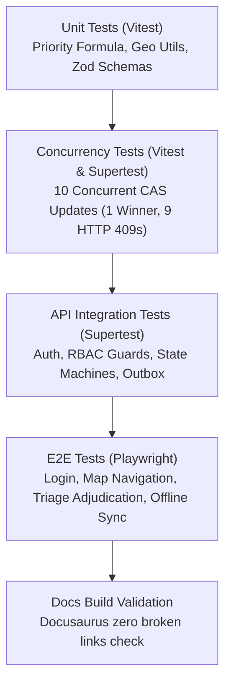

# Testing Strategy & Automated Quality Gates

<span className="badge-implemented">Implemented</span>

DRAXELYRA enforces rigorous automated testing covering unit formulas, state machine transitions, concurrent race conditions, API contracts, and end-to-end browser flows.



---

## Test Execution Commands

```bash
# Run unit tests across all workspace packages
pnpm run test

# Run API integration tests against isolated PostgreSQL test container
pnpm --filter @workspace/api-server run test

# Run Vitest in watch mode during active development
pnpm --filter @workspace/api-server run test:watch

# Execute Playwright end-to-end test suite
pnpm run test:e2e

# Validate documentation compilation and link integrity
pnpm run docs:build
```
