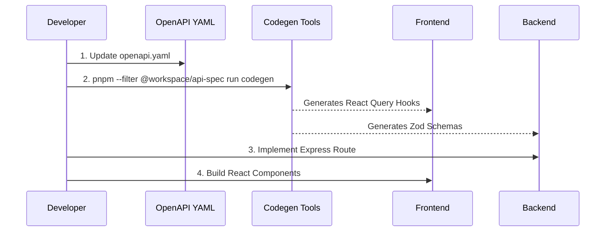

# Contributing Guidelines

<span className="badge-implemented">Implemented</span>

This document outlines the standard workflows, architecture patterns, and technical stacks required for contributing to the DRAXELYRA platform. We adhere to a strict API-first, contract-driven development process.

## The OpenAPI-First Workflow

All feature development that involves client-server communication must begin with the OpenAPI specification. This ensures both frontend and backend teams have a unified contract.



### Step-by-step Workflow

1.  **Edit the API Specification**:
    Navigate to `lib/api-spec/openapi.yaml` and define the new endpoints, request bodies, and response definitions using OpenAPI 3.1 syntax.
2.  **Run Code Generation**:
    Execute the generation script to create Zod schemas and TanStack Query hooks.
    ```bash
    pnpm --filter @workspace/api-spec run codegen
    ```
3.  **Backend Implementation**:
    In `artifacts/api-server`, create or modify the route handlers. Utilize the newly generated Zod schemas from `@workspace/api-zod` to validate incoming requests.
4.  **Frontend Implementation**:
    In `artifacts/draxelyra`, import the generated TanStack hooks from `@workspace/api-client-react` to bind data to your UI components.
5.  **Run Tests**:
    Ensure all components remain functional.
    ```bash
    pnpm test
    ```

## Technical Stack Reference

Ensure your local development environment supports the following technologies before contributing:

*   **Runtime**: Node.js 20+ with TypeScript 5.x.
*   **Backend Ecosystem**:
    *   Framework: Express 5.2
    *   Database Toolkit: Drizzle ORM
    *   Database: PostgreSQL 15
    *   Bundler: esbuild
*   **Frontend Ecosystem**:
    *   Framework: React 19
    *   Build Tool: Vite 6
    *   Routing: Wouter 3
    *   Data Fetching: TanStack Query (auto-generated)
    *   Mapping: MapLibre GL
    *   Styling: Tailwind CSS 4, Radix UI Primitives
*   **Testing Framework**: Vitest
*   **Package Manager**: pnpm (Workspaces)

## Commit and Review Process

*   Prefix commits with conventional tags (e.g., `feat:`, `fix:`, `chore:`, `docs:`).
*   Ensure `pnpm run build` and `pnpm test` pass cleanly before requesting a review.
*   Never manually modify files in `lib/api-zod/` or `lib/api-client-react/`. These are strictly generated artifacts.
