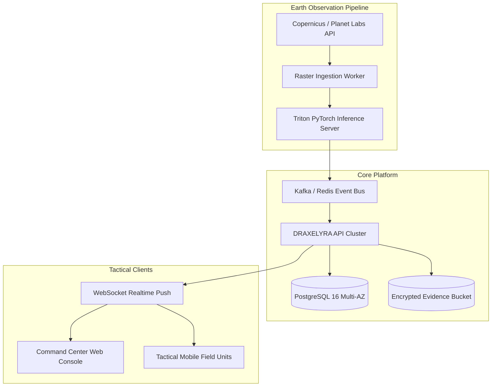

# Future Architecture Vision

```mermaid
graph TB
    subgraph Earth Observation Pipeline
        Sat[Copernicus / Planet Labs API] --> IngestWorker[Raster Ingestion Worker]
        IngestWorker --> MLCluster[Triton PyTorch Inference Server]
    end
    
    subgraph Core Platform
        MLCluster --> EventBus[Kafka / Redis Event Bus]
        EventBus --> CoreAPI[DRAXELYRA API Cluster]
        CoreAPI --> DB[(PostgreSQL 16 Multi-AZ)]
        CoreAPI --> S3[(Encrypted Evidence Bucket)]
    end
    
    subgraph Tactical Clients
        CoreAPI --> WS[WebSocket Realtime Push]
        WS --> WebApp[Command Center Web Console]
        WS --> MobileApp[Tactical Mobile Field Units]
    end
```
